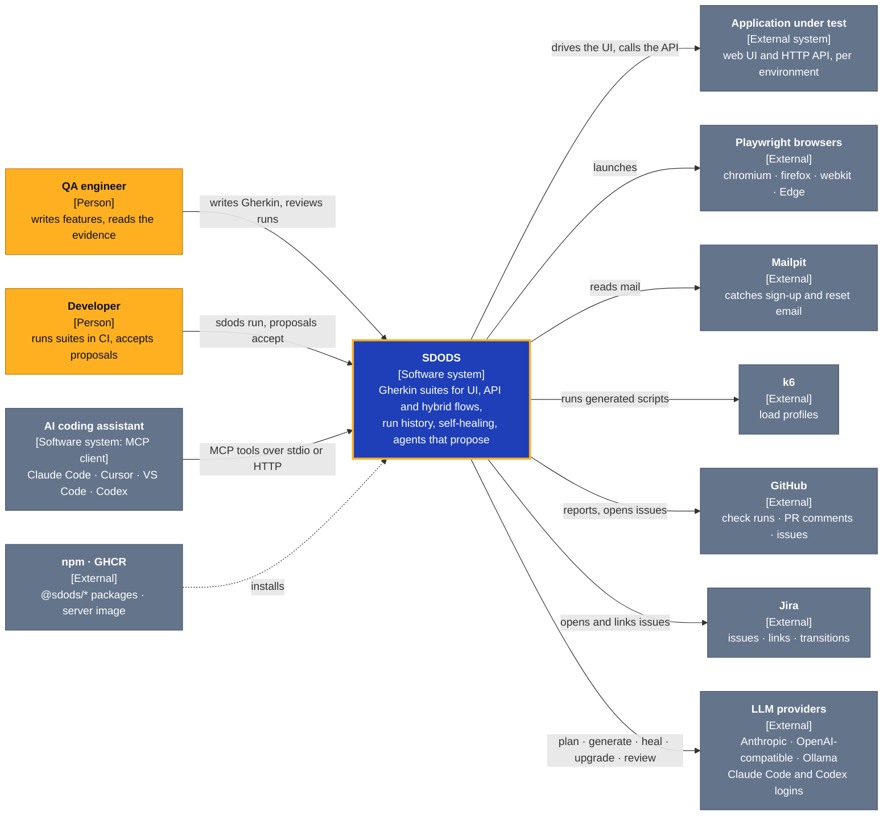
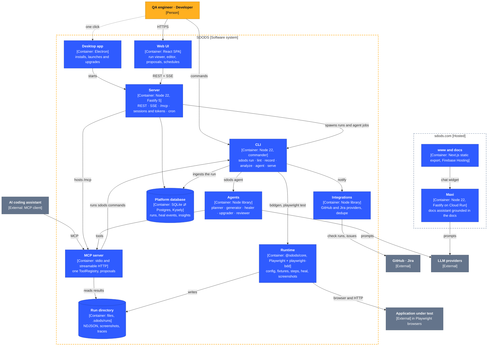
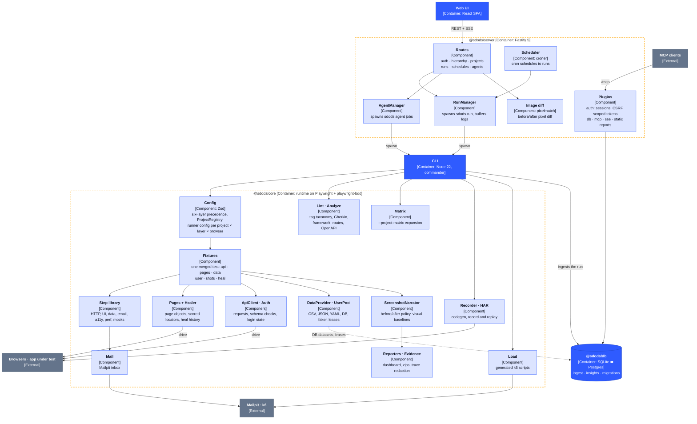

<Learn>
  How SDODS is put together, at three zoom levels: who uses it and what it talks to, the processes
  and stores it is made of, and the components inside the runtime and the server.
</Learn>

The diagrams use [C4](https://c4model.com) notation. Amber boxes are people, the deep-blue box is
SDODS as a whole, blue boxes are containers (things that run or store data), pale-blue boxes are
components inside a container, grey boxes are external systems, and dashed outlines are boundaries.
The contributor reference, with the decisions and trade-offs behind the design, is
`docs/ARCHITECTURE.md` in the repository.

## Level 1: System context

Who uses SDODS, and what it talks to.



## Level 2: Containers

What SDODS is made of, and which process calls which. The server and the MCP server do not
reimplement anything: they spawn the same `sdods` commands you run yourself, so CI needs only Node
and the repository, and nothing needs a database until you want history.



## Level 3: Components of the runtime and the server

Inside `@sdods/core`, which a `sdods run` executes on Playwright workers, and inside
`@sdods/server`, which turns HTTP requests and cron schedules into CLI runs.



## The package graph

The packages depend on each other in one direction, and TypeScript project references fail the
build if a cycle appears. The CLI depends on all of them and imports each one lazily.

```
contracts → core → db → mcp → integrations → agents → server → web
```

**Runtime split.** Playwright workers, vitest and the native database drivers run on Node 22. Bun
is the package manager, script runner and bundler; nothing executes tests under Bun.
