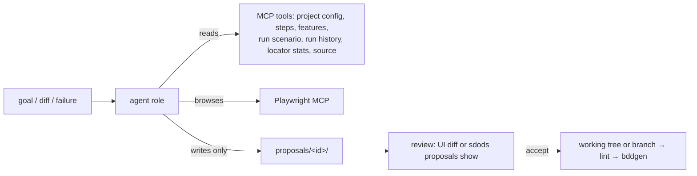

<Learn>
  Which agent roles exist, what each reads and produces, how the adapter keeps SDODS independent of
  one LLM vendor, how proposals are reviewed, and how cost is bounded.
</Learn>

## Roles

| Role      | Input                                                                         | Output                                                 |
| --------- | ----------------------------------------------------------------------------- | ------------------------------------------------------ |
| planner   | a goal, the running app through Playwright MCP or the source tree and OpenAPI | `docs/test-plans/<name>.md` with tagged scenarios      |
| generator | a plan, a goal or a recorded spec                                             | feature file, only-unmatched steps, page object        |
| healer    | a failing scenario, its error, ARIA snapshot and locator stats                | a page-object or step patch, re-run result             |
| upgrader  | a git diff range or two OpenAPI versions                                      | new and updated scenarios, data rows, deprecation list |
| reviewer  | changed features                                                              | review notes and optional data-driven refactors        |



## Adapter

Roles do not know which model runs them. `--adapter`, `SDODS_LLM_PROVIDER` or `agents.provider` in the project YAML picks one; when none is set SDODS auto-detects in this order: `ANTHROPIC_API_KEY` → `claude` CLI → `codex` CLI → `OPENAI_API_KEY` → `fake`.

| Adapter             | Runs on                                         | Needs                                  | Notes                                                                          |
| ------------------- | ----------------------------------------------- | -------------------------------------- | ------------------------------------------------------------------------------ |
| `claude`            | Claude Agent SDK + bundled Playwright MCP       | `ANTHROPIC_API_KEY`                    | full tool loop, budgets enforced by the SDK                                    |
| `claude-code`       | your logged-in Claude Code CLI (`claude -p`)    | `claude login`                         | no API key; uses your subscription; tools via the sdods MCP server             |
| `codex`             | your logged-in OpenAI Codex CLI (`codex exec`)  | `codex login`                          | no API key; ChatGPT account; tools via the sdods MCP server, read-only sandbox |
| `openai-compatible` | any chat-completions endpoint with tool calling | `OPENAI_API_KEY` (+ `OPENAI_BASE_URL`) | Azure, Ollama, vLLM …                                                          |
| `fake`              | scripted responses                              | nothing                                | tests and `--dry-run`                                                          |

LLM keys and logins are yours and billed by the provider; SDODS's own API tokens are free. See [Claude Code and Codex CLI](/docs/guides/claude-code-and-codex) and [Tokens and keys](/docs/reference/tokens-and-keys).

## Commands

```bash
bun run sdods agent plan     -p demo-shop --goal "checkout with a discount code"
bun run sdods agent generate -p demo-shop --plan docs/test-plans/checkout.md
bun run sdods agent heal     -p demo-shop --scenario <fingerprint>
bun run sdods agent upgrade  -p demo-shop --diff main..feature/x
bun run sdods agent review   -p demo-shop
bun run sdods agent generate -p demo-shop --goal "login" --dry-run --adapter fake
bun run sdods proposals list
bun run sdods proposals show <id>
bun run sdods proposals accept <id> --branch sdods/<id>
```

## Budgets

```yaml title="sdods.project.yaml"
agents:
  models: { planner: claude-opus-5, generator: claude-opus-5, healer: claude-opus-5 }
  maxTurns: { healer: 30 }
  budgetUsd: { default: 2, planner: 5 }
  maxRunsPerJob: 3
```

Every job records model, turns and cost; a job stops at its budget.

## Claude Code

`sdods agent install-claude` writes `.claude/agents/sdods-*.md`, `.mcp.json` and the repository's `AGENT.md`/`SKILL.md`, so Claude Code users get the same roles as the CLI.

## Next steps

- [Reviewing agent proposals](/docs/best-practices/reviewing-proposals)
- [MCP](/docs/guides/mcp)
