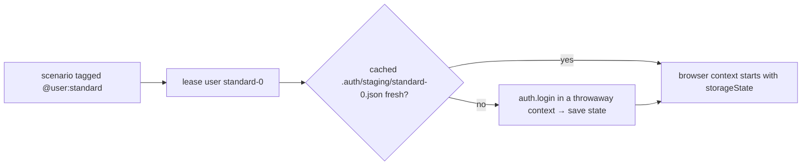

<Learn>
  Which authentication strategies AutoMax supports, where storage state is cached, how a leased
  user's state is applied to a browser context, and how to capture state for the recorder.
</Learn>

## Strategies

| Strategy                   | How state is produced                                                                     |
| -------------------------- | ----------------------------------------------------------------------------------------- |
| `none`                     | no login                                                                                  |
| `form`                     | a headless login with the selectors in `auth.form`, then `context.storageState()`         |
| `token`                    | fetch a token, place it as a header, cookie or local-storage entry                        |
| `oauth-client-credentials` | client-credentials grant against `tokenUrl`                                               |
| `sso`                      | interactive: `automax auth capture --interactive` opens codegen so a person completes SSO |
| `custom`                   | your `defineAuth` implementation in `steps/auth.ts`                                       |

```yaml title="automax.project.yaml"
auth:
  strategy: form
  storageState: true
  maxAgeMinutes: 120
  form:
    loginPath: /
    usernameSelector: '#user-name'
    passwordSelector: '#password'
    submitSelector: '#login-button'
    readyUrl: /inventory.html
```

## Where state lives

```text
projects/demo-shop/.auth/staging/standard-0.json    # gitignored
projects/demo-shop/.auth/staging/standard-1.json
```

The index is the pool position of the user. A sidecar records when the state was captured; the fixture recaptures `form` and `token` state after `maxAgeMinutes`.



## Capture state on demand

```bash
bun run automax auth capture -p demo-shop -e staging --user standard
bun run automax auth capture -p demo-shop -e staging --user standard --all
bun run automax auth capture -p demo-shop -e staging --user admin --interactive
bun run automax auth list -p demo-shop -e staging
```

The recorder uses the same files through `--load-storage`, so you can record flows as any pool user.

## Custom strategy

```ts title="projects/demo-shop/steps/auth.ts"
import { defineAuth } from '@automax/core/auth';

export const auth = defineAuth({
  strategy: 'custom',
  async login({ browser, config, user }) {
    const context = await browser.newContext({ baseURL: config.env.ui.baseUrl });
    const page = await context.newPage();
    await page.goto('/');
    await page.getByLabel('Username').fill(user.username);
    await page.getByLabel('Password').fill(user.password);
    await page.getByRole('button', { name: 'Login' }).click();
    await page.waitForURL('**/inventory.html');
    return context; // AutoMax saves and closes it
  },
});
```

## Next steps

- [Record and playback with roles and environments](/docs/guides/record-playback-roles-environments)
- [Security](/docs/guides/security)
