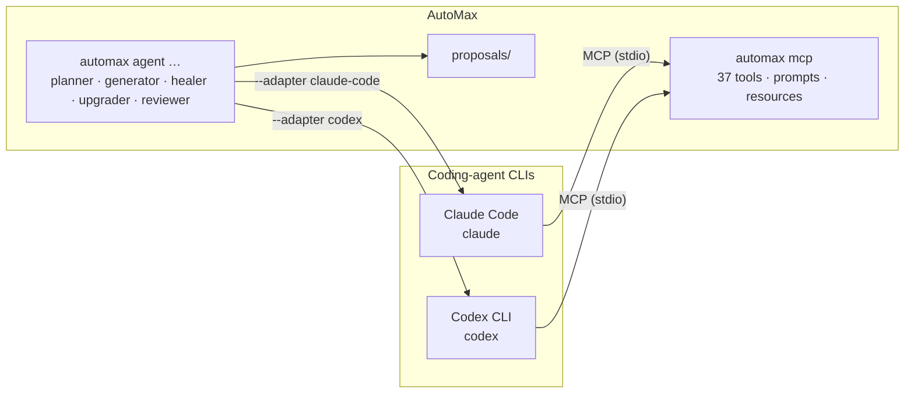

<Learn>
  How to register AutoMax with Claude Code and Codex so they can drive your test platform, how to
  run AutoMax's own agent roles through those CLIs instead of an API key, and what each client sees.
</Learn>

## Two directions



1. **The CLI drives AutoMax.** Register the AutoMax MCP server with the client; then ask it to list projects, run a suite, read a scenario's before/after screenshots, or write a feature proposal.
2. **AutoMax drives the CLI.** `automax agent … --adapter claude-code|codex` runs a role through the CLI's own login. No `ANTHROPIC_API_KEY` or `OPENAI_API_KEY` is needed; the CLI's subscription or account pays.

## Set up Claude Code

<Steps>

### Install and log in

```bash
npm i -g @anthropic-ai/claude-code
claude login
```

### Register AutoMax

```bash
bun run automax agent install --for claude -p demo-shop -e staging
```

This writes `.claude/agents/automax-<role>.md` (one subagent per AutoMax role), `CLAUDE.md`, `AGENT.md` and `SKILL.md`, and runs `claude mcp add -s project automax -- npx automax mcp --project demo-shop --env staging` (plus the bundled Playwright MCP). Use `--no-mcp` to skip the registration, or `automax mcp install claude --file` to write `.mcp.json` instead of calling the CLI.

### Use it

```bash
claude
# > use the automax tools to run the demo-shop smoke suite on chromium and summarise failures
# > @automax-healer fix the "Add a product to the cart" scenario from the last run
```

`claude mcp list` shows `automax` and `playwright`. Every AutoMax tool appears as `mcp__automax__<tool>`.

</Steps>

## Set up Codex CLI

<Steps>

### Install and log in

```bash
npm i -g @openai/codex
codex login          # ChatGPT account; or set OPENAI_API_KEY
```

### Register AutoMax

```bash
bun run automax agent install --for codex -p demo-shop -e staging
```

This writes `AGENTS.md` (Codex reads it as project instructions; the five roles become sections), `AGENT.md` and `SKILL.md`, and runs `codex mcp add automax -- npx automax mcp --project demo-shop --env staging` (plus Playwright). Without the CLI on PATH the same entries are merged into `~/.codex/config.toml` under `[mcp_servers.automax]`; other servers in that file are kept.

### Use it

```bash
codex
# > use the automax tools to list projects and start the api-contract process for demo-shop
codex mcp list
```

</Steps>

## Run AutoMax agents on the CLI logins

```bash
bun run automax agent review   -p demo-shop --adapter claude-code
bun run automax agent heal     -p demo-shop --scenario <fingerprint> --adapter codex --max-turns 20
bun run automax agent generate -p demo-shop --goal "checkout with a discount code"   # auto-detects
```

What the adapters do:

| Adapter       | Command executed                                                                                                                                                                                                   | Tools                                          | Cost reporting                                  |
| ------------- | ------------------------------------------------------------------------------------------------------------------------------------------------------------------------------------------------------------------ | ---------------------------------------------- | ----------------------------------------------- |
| `claude-code` | `claude -p <prompt> --output-format stream-json --mcp-config <temp.json> --strict-mcp-config --allowedTools Read Glob Grep mcp__automax__* mcp__playwright__* --disallowedTools Bash Write Edit … --max-turns <n>` | AutoMax + Playwright MCP, read-only file tools | `total_cost_usd` from the CLI when available    |
| `codex`       | `codex exec --json --ephemeral -s read-only -c mcp_servers.automax.command=… -c mcp_servers.automax.args=… <system + prompt>`                                                                                      | AutoMax + Playwright MCP, read-only sandbox    | token usage only (Codex reports no dollar cost) |

Both adapters keep the AutoMax guarantee: roles can only write proposals (`automax proposals list|show|accept`). When no adapter is chosen, AutoMax auto-detects: `ANTHROPIC_API_KEY` → `claude` CLI → `codex` CLI → `OPENAI_API_KEY` → `fake`, and prints which one it picked.

<Callout type="info">
  `automax doctor` shows both CLIs (installed, logged in) and the full token matrix. Pin a model
  with `AUTOMAX_CLAUDE_CODE_MODEL` / `AUTOMAX_CODEX_MODEL` or `--model`; by default the CLI's
  configured model is used.
</Callout>

## What each client sees

| Client                    | Reads                                                               | Gets from AutoMax                                                    |
| ------------------------- | ------------------------------------------------------------------- | -------------------------------------------------------------------- |
| Claude Code               | `CLAUDE.md`, `.claude/agents/*.md`, `.claude/skills/*`, `.mcp.json` | MCP tools, prompts, resources; role subagents; the record/run skills |
| Codex                     | `AGENTS.md`, `~/.codex/config.toml`                                 | MCP tools, prompts, resources; role instructions as sections         |
| Cursor, VS Code, Windsurf | `.cursor/mcp.json`, `.vscode/mcp.json`, `.windsurf/mcp.json`        | MCP tools, prompts, resources                                        |

## Next steps

- [Tokens and keys](/docs/reference/tokens-and-keys): what is mandatory, one-of, optional.
- [Agents](/docs/guides/agents): the roles and their proposals.
- [MCP](/docs/guides/mcp): tool families, scopes, HTTP transport.
