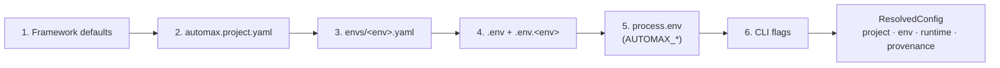

<Learn>
The exact order in which AutoMax merges configuration, the merge rules for objects and arrays, how `${VAR}` and `${VAR:-default}` resolve, why literal secrets are refused, and how to see which layer produced a value.
</Learn>

## The six layers



Later layers win. Layers 4 and 5 are also the sources for `${VAR}` references; layer 5 additionally maps `AUTOMAX_*` variables onto configuration paths.

| Layer | Source | Example |
|---|---|---|
| 1 | built-in defaults | screenshot policy, heal timeouts, retries |
| 2 | `automax.project.yaml` | layers, browsers, tags, routes, data |
| 3 | `envs/<env>.yaml` | base URLs, API auth, pool size; may override `screenshots`, `heal`, `timeouts`, `perf` |
| 4 | `.env`, `.env.<env>`, `.env.local`, `.env.<env>.local` in the repo root and the project directory (project wins) | `DEMO_SHOP_PASSWORD=...` |
| 5 | `process.env` | `AUTOMAX_UI_BASE_URL`, `AUTOMAX_ENV`, `CI` |
| 6 | flags on `automax run` and friends | `-e local`, `--headed`, `--shard 2/3` |

## Merge rules

- Objects merge recursively.
- Arrays **replace** (a later `browsers: [chromium]` removes firefox and webkit).
- `undefined` is skipped; `null` clears a key.

## Variables

```yaml
api:
  auth: { type: bearer, token: '${API_TOKEN}' }
vars:
  password: '${DEMO_SHOP_PASSWORD:-secret_sauce}'
```

- `${VAR}` must resolve from layer 4 or 5; otherwise validation fails with the path and a hint.
- `${VAR:-default}` uses the default when the variable is absent.
- `.env` files are **parsed**, never injected into `process.env`, so a shell variable always beats a file.

<Callout type="error" title="Literal secrets are refused">
A key whose name looks like a secret (`password`, `secret`, `token`, `apiKey`, `clientSecret`) must hold a `${VAR}` reference. A literal value fails validation with `CONFIG_SECRET_LITERAL`.
</Callout>

## Explain a value

```bash automax-verify
bun run automax config show -p demo-shop -e staging --explain
```

Sample output (truncated):

```text
path                              layer    value
env.api.baseUrl                   envYaml  https://jsonplaceholder.typicode.com
env.ui.baseUrl                    envYaml  https://www.saucedemo.com
env.vars.standardPassword         envYaml  ***
project.screenshots.onlyOnFailure envYaml  false
project.screenshots.policy.@smoke project  scenario
runtime.retries                   defaults 0
```

Secret-looking values are redacted; add `--show-secrets` when you must see them. `--json` prints the full tree.

## Environment variables that map to config

| Variable | Path |
|---|---|
| `AUTOMAX_ENV` | environment name |
| `AUTOMAX_UI_BASE_URL`, `AUTOMAX_API_BASE_URL` | `env.ui.baseUrl`, `env.api.baseUrl` |
| `AUTOMAX_HEADED`, `AUTOMAX_WORKERS`, `AUTOMAX_SHARD`, `AUTOMAX_RETRIES` | runtime |
| `AUTOMAX_SHOT_POLICY`, `AUTOMAX_SHOTS_ONLY_ON_FAILURE` | screenshot policy |
| `AUTOMAX_HEAL` | `project.heal.enabled` |
| `AUTOMAX_HAR_MODE`, `AUTOMAX_OFFLINE`, `AUTOMAX_UPDATE_SNAPSHOTS` | runtime |
| `AUTOMAX_RUN_ID`, `AUTOMAX_ARTIFACTS_DIR` | run identity and location |

The full list is in the [environment variables reference](/docs/reference/environment-variables).

## Next steps

- [Tags and suites](/docs/guides/tags-and-suites)
- [Project YAML reference](/docs/reference/project-yaml)
