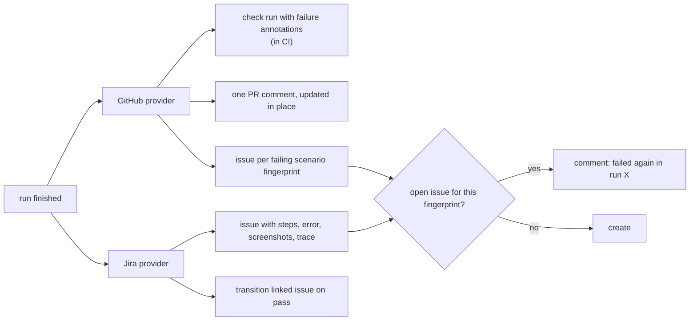

<Learn>
  How the GitHub and Jira providers are configured per project with secret names only, what each
  does on a finished run, how issues are deduplicated by scenario fingerprint, and how tags link
  scenarios to existing issues.
</Learn>

## Configure

```yaml title="sdods.project.yaml"
integrations:
  github:
    enabled: true
    owner: acme
    repo: shop
    checkRun: true
    prComment: true
    createIssueOnFailure: smoke # never | smoke | always
    labels: [sdods, test-failure]
    tokenEnv: GITHUB_TOKEN
  jira:
    enabled: true
    baseUrl: https://acme.atlassian.net
    projectKey: SHOP
    issueType: Bug
    emailEnv: JIRA_EMAIL
    tokenEnv: JIRA_API_TOKEN
    createIssueOnFailure: always
    transitionOnPass: Done
    linkTaggedScenarios: true
```

Only variable **names** are stored; values come from the environment where `sdods` runs.

The GitHub token needs `issues: write` for issues and labels, `checks: write` for check runs and `pull-requests: write` for the PR comment:

```yaml title=".github/workflows/e2e.yml"
permissions:
  contents: read
  issues: write
  checks: write
  pull-requests: write
```

## What happens after a run

`sdods run` publishes the run to every enabled integration when it finishes; no separate step is needed. Pass `--no-notify` to skip it, for example when shards run in parallel jobs and a later job merges them and runs `sdods integrations notify --run-id <id> --from-files` once (sharded runs never notify on their own). A notify failure is reported as a warning and does not change the run's exit code.



Before creating an issue, SDODS searches the repository for an open issue whose body carries the scenario's `sdods-fingerprint:<fingerprint>` marker, so a fresh CI runner without `.sdods/issue-links.json` comments on the existing issue instead of opening a duplicate. Notifying the same run twice does not comment twice.

Issue bodies include the scenario, the error, screenshots, and the runner's `video.webm` and `trace.zip` for the failing attempt, with the command that opens the trace:

```bash
npx playwright show-trace .sdods/runs/<runId>/runner-output/<test>/trace.zip
```

Links point at `SDODS_PUBLIC_URL` when a server is configured, at release assets with `uploadToRelease`, and otherwise at the CI run's artifacts with the path inside them.

## Link scenarios to issues

```gherkin
@ui @regression @jira:SHOP-42 @github:123
Scenario: Discount code applies
```

`sdods integrations sync -p demo-shop` scans features for these tags, creates links, and refreshes their status. The run viewer shows the status next to the scenario.

## Commands

```bash
bun run sdods integrations test -p demo-shop --provider github
bun run sdods integrations test -p demo-shop --provider github --create-labels
bun run sdods integrations notify --run-id <id> --from-files --dry-run
bun run sdods integrations sync -p demo-shop
bun run sdods integrations links -p demo-shop
```

`--from-files` builds the summary from the run directory, so notifications work without a database.

## Next steps

- [Sharding and CI](/docs/guides/sharding-and-ci)
- [Security](/docs/guides/security)
