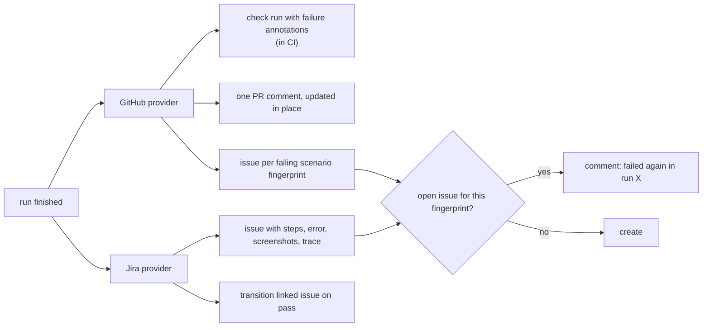

<Learn>
How the GitHub and Jira providers are configured per project with secret names only, what each does on a finished run, how issues are deduplicated by scenario fingerprint, and how tags link scenarios to existing issues.
</Learn>

## Configure

```yaml title="automax.project.yaml"
integrations:
  github:
    enabled: true
    owner: siri1410
    repo: AutoMax
    checkRun: true
    prComment: true
    createIssueOnFailure: smoke      # never | smoke | always
    labels: [automax, test-failure]
    tokenEnv: GITHUB_TOKEN
  jira:
    enabled: true
    baseUrl: https://acme.atlassian.net
    projectKey: SHOP
    issueType: Bug
    emailEnv: JIRA_EMAIL
    tokenEnv: JIRA_API_TOKEN
    createIssueOnFailure: always
    transitionOnPass: Done
    linkTaggedScenarios: true
```

Only variable **names** are stored; values come from the environment where `automax` runs.

## What happens after a run



## Link scenarios to issues

```gherkin
@ui @regression @jira:SHOP-42 @github:123
Scenario: Discount code applies
```

`automax integrations sync -p demo-shop` scans features for these tags, creates links, and refreshes their status. The run viewer shows the status next to the scenario.

## Commands

```bash
bun run automax integrations test -p demo-shop --provider github
bun run automax integrations notify --run-id <id> --from-files --dry-run
bun run automax integrations sync -p demo-shop
bun run automax integrations links -p demo-shop
```

`--from-files` builds the summary from the run directory, so notifications work without a database.

## Next steps

- [Sharding and CI](/docs/guides/sharding-and-ci)
- [Security](/docs/guides/security)
