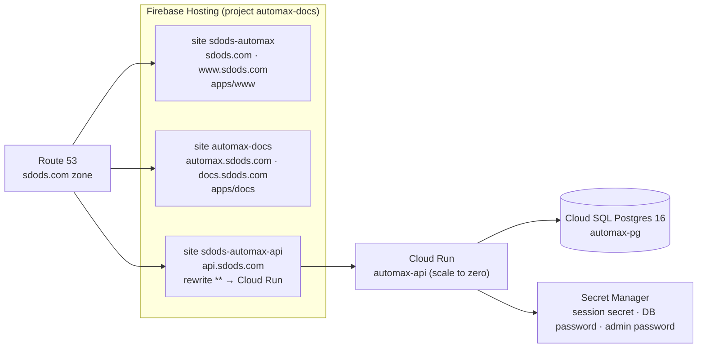

<Learn>
  Where each part of SDODS runs in production, what it costs, which secrets exist, and the exact
  commands to deploy, rotate and tear down. Everything here is reproducible for another domain.
</Learn>

## Topology



| Host                               | Serves                                             | Deployed by                  |
| ---------------------------------- | -------------------------------------------------- | ---------------------------- |
| `sdods.com`, `www.sdods.com`       | landing site (`apps/www`)                          | `.github/workflows/www.yml`  |
| `docs.sdods.com`, `docs.sdods.com` | this documentation (`apps/docs`)                   | `.github/workflows/docs.yml` |
| `api.sdods.com`                    | Fastify API, web UI and `/mcp` (`packages/server`) | `.github/workflows/api.yml`  |

Static sites deploy on every push to `main` and get a preview channel per pull request. The API image is built with Cloud Build and deployed to Cloud Run when the `GCP_SA_KEY_AUTOMAX` secret is present.

## DNS

Firebase Hosting needs a CNAME for subdomains and an A record plus an ownership TXT for the apex. In Route 53 the zone ends up as:

| Record                                | Type  | Value                                                                    |
| ------------------------------------- | ----- | ------------------------------------------------------------------------ |
| `sdods.com`                           | A     | `199.36.158.100` (Firebase)                                              |
| `sdods.com`                           | TXT   | `hosting-site=sdods-automax` (plus existing verification and SPF values) |
| `www.sdods.com`                       | CNAME | `sdods-automax.web.app`                                                  |
| `docs.sdods.com`, `automax.sdods.com` | CNAME | `automax-docs.web.app`                                                   |
| `api.sdods.com`                       | CNAME | `sdods-automax-api.web.app`                                              |

Certificates are issued by Firebase automatically once ownership is verified; nothing is minted by hand. Domains are registered on a site with the Hosting REST API (`customDomains.create`, header `x-goog-user-project`) or the Firebase console.

<Callout type="warn">
  Mail records (MX, SPF, DKIM, DMARC) stay untouched. When you add the apex TXT record, include the
  existing TXT values in the same record set; replacing them would break mail and Google
  verification.
</Callout>

## The API on Cloud Run

One container image serves everything: `deploy/entrypoint.sh serve` runs migrations and starts the server; `bootstrap` creates the admin user and makes it organization owner; any other argument is passed to the `sdods` CLI. The image ships the browser engines, so UI runs triggered from the web UI work inside the container.

<Steps>
  <Step>
    **Build and deploy**

    ```bash
    bun run api:build            # Cloud Build → Artifact Registry
    bun run api:deploy           # gcloud run deploy automax-api (secrets, Cloud SQL connector)
    bun run api:bootstrap        # Cloud Run job: migrate, sync hierarchy, create admin (idempotent)
    bun run api:deploy-hosting   # Firebase site with the rewrite to Cloud Run
    ```

  </Step>
  <Step>
    **Read the admin password**

    ```bash
    gcloud secrets versions access latest --secret automax-admin-password --project automax-docs
    ```

    Log in at `https://api.sdods.com`, then create free scoped API tokens under Settings → API tokens for MCP clients and CI ingest.

  </Step>
  <Step>
    **Point CI ingest at it**

    Set `SDODS_SERVER_URL=https://api.sdods.com` and `SDODS_TOKEN=<token with runs:ingest>` as repository secrets; the ci workflow then uploads run results and artifacts after every matrix run.

  </Step>
</Steps>

Behind the Firebase rewrite only a cookie named `__session` reaches Cloud Run, so the deployment sets `SDODS_SESSION_COOKIE=__session`. Run artifacts produced by UI-triggered runs live in `/tmp` of the instance; durable results come from CI ingest or a mounted bucket.

## Secrets and identities

Cloud resource names below still carry the pre-rebrand prefix. They identify infrastructure that
is already serving traffic, so renaming them would mean new service URLs, new DNS records and a
fresh set of secrets for no user-visible gain. Treat them as opaque identifiers, not as branding.

| Name                                    | Where           | Used for                                                                                                     |
| --------------------------------------- | --------------- | ------------------------------------------------------------------------------------------------------------ |
| `automax-session-secret`                | Secret Manager  | signs session cookies                                                                                        |
| `automax-db-password`                   | Secret Manager  | Cloud SQL user `automax`                                                                                     |
| `automax-admin-password`                | Secret Manager  | bootstrap admin (read once, then change it in the UI)                                                        |
| `automax-api-runtime@…`                 | service account | Cloud Run runtime: Secret Manager accessor, Cloud SQL client                                                 |
| `github-deploy-api@…`                   | service account | CI: Cloud Build, Cloud Run admin, Artifact Registry writer; key stored as GitHub secret `GCP_SA_KEY_AUTOMAX` |
| `FIREBASE_SERVICE_ACCOUNT_AUTOMAX_DOCS` | GitHub secret   | static site deploys                                                                                          |

Rotate a secret with `gcloud secrets versions add <name> --data-file=…` and redeploy; services read `:latest` on each new revision.

## Cost

| Item                                                  | Monthly (us-central1 list prices)  |
| ----------------------------------------------------- | ---------------------------------- |
| Cloud SQL `db-f1-micro`, 10 GB HDD, zonal, no backups | about 8–10 USD, always on          |
| Cloud Run, min 0 instances, 1 vCPU / 2 GiB            | 0 idle; free tier covers light use |
| Artifact Registry, Secret Manager, Firebase Hosting   | well under 1 USD                   |

`MIN_INSTANCES=1 bun run api:deploy` removes cold starts for roughly 8 USD more per month.

## Operate and tear down

| Task             | Command                                                                                                                                     |
| ---------------- | ------------------------------------------------------------------------------------------------------------------------------------------- |
| Logs             | `gcloud run services logs read automax-api --region us-central1 --limit 100`                                                                |
| Manual migration | `gcloud run jobs execute automax-bootstrap --region us-central1 --wait`                                                                     |
| Backup           | `sdods db export <dir>` against `DATABASE_URL`                                                                                              |
| Tear down        | delete the Cloud Run service and job, the Cloud SQL instance, the three secrets and the Firebase site; restore the previous Route 53 record |

The full command reference lives in `deploy/README.md` in the repository.

## Next steps

- [GitHub and Jira](/docs/guides/github-and-jira/) to turn on issue creation from the hosted API.
- [Security](/docs/guides/security/) for tokens, roles and what is never stored.
- [Sharding and CI](/docs/guides/sharding-and-ci/) for the workflow that feeds results into this server.
