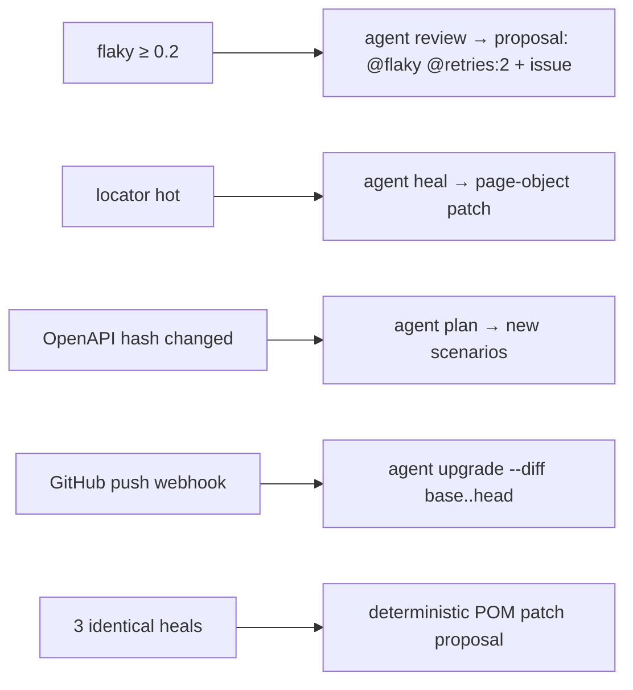

<Learn>
  Which signals every run contributes, how flakiness, locator fragility, environment stability and
  suite health are computed, and which automations they trigger.
</Learn>

## Signals

Durations, retries and outcomes per attempt, heal events, locator failures parsed from errors, visual diff ratios, API latency per endpoint, accessibility violations, environment, browser, worker and commit.

## Scores

| Score                  | Formula (window of 30 runs)                                                                     | Threshold                                                           |
| ---------------------- | ----------------------------------------------------------------------------------------------- | ------------------------------------------------------------------- |
| Flakiness per scenario | `(passed on retry + outcome flips) / runs`                                                      | quarantine candidate at ≥ 0.2 with ≥ 10 runs                        |
| Locator fragility      | `(failures + 0.5 × heals) / uses` over 30 days                                                  | hot at ≥ 0.1 with ≥ 3 heals                                         |
| Environment stability  | `1 − env-attributed failures / runs`                                                            | network, 5xx and timeouts across ≥ 3 unrelated scenarios in one run |
| Suite health           | `0.5 × pass rate + 0.2 × (1 − mean flaky) + 0.2 × (1 − mean fragility) + 0.1 × duration budget` | 7-run moving average                                                |

```bash
bun run automax insights compute -p demo-shop --window 30
bun run automax insights show -p demo-shop
```

## Triggers



All triggers are CLI commands; the server's scheduler only spawns them. Nothing is applied without review.

## Quarantine

A quarantined scenario keeps running but no longer blocks gates; its status is visible on the dashboard until the fix lands. Toggle it in the UI or with `insights quarantine <fingerprint>`.

## Next steps

- [Flaky triage playbook](/docs/best-practices/flaky-triage)
- [Agents](/docs/guides/agents)
