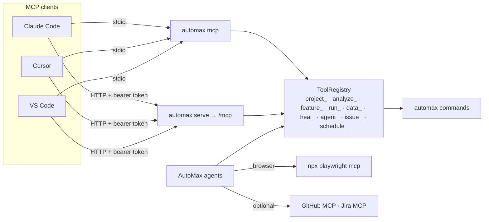

<Learn>
How to connect an MCP client to AutoMax over stdio or HTTP, which tool families exist, how scopes gate them, and how a project declares external MCP servers for its agents.
</Learn>

## Topology



Browser driving stays with Playwright MCP; AutoMax MCP drives the automation project. Install both side by side.

## Connect

<Tabs items={['Claude Code', 'Cursor', 'VS Code', 'HTTP']}>
<Tab value="Claude Code">
```bash
claude mcp add automax -- npx automax mcp --project demo-shop --env staging
claude mcp add playwright -- npx playwright mcp --headless
```
</Tab>
<Tab value="Cursor">
```json title=".cursor/mcp.json"
{ "mcpServers": { "automax": { "command": "npx", "args": ["automax", "mcp", "--project", "demo-shop"] } } }
```
</Tab>
<Tab value="VS Code">
```json title=".vscode/mcp.json"
{ "servers": { "automax": { "type": "stdio", "command": "npx", "args": ["automax", "mcp", "--project", "demo-shop"] } } }
```
</Tab>
<Tab value="HTTP">
```bash
claude mcp add --transport http automax https://automax.example.com/mcp --header "Authorization: Bearer $AUTOMAX_TOKEN"
```
</Tab>
</Tabs>

`automax mcp install claude|cursor|vscode` writes these files for you.

## Tool families

| Prefix | Examples |
|---|---|
| `project_` | `project_list`, `project_get_config`, `project_list_envs`, `project_doctor` |
| `analyze_` | `analyze_project`, `analyze_routes`, `analyze_openapi`, `analyze_locators`, `analyze_coverage`, `analyze_best_practices`, `analyze_change_impact`, `analyze_failure` |
| `feature_` / `step_` | `feature_list`, `feature_read`, `feature_write` (proposal), `feature_lint`, `step_list`, `step_find` |
| `run_` | `run_tests`, `run_get`, `run_get_scenario`, `run_list`, `run_cancel`, `run_har_replay` |
| `data_` | `data_list_datasets`, `data_load`, `data_pool_status` |
| `heal_` / `insights_` | `heal_events`, `heal_locator_stats`, `insights_flaky`, `insights_health` |
| `record_` | `record_start` (local only), `record_convert`, `auth_capture` |
| `agent_` / `proposal_` | `agent_plan`, `agent_generate`, `agent_heal`, `proposal_list`, `proposal_accept` |
| `issue_` / `schedule_` | `issue_create`, `issue_link`, `schedule_list`, `schedule_run_now` |

Write tools produce proposals; they never touch your working tree. Every tool carries annotations, a Zod input schema and a link to its reference page.

## Scopes

Over HTTP the bearer token's scopes decide which tools appear: `viewer` tokens see read tools, `editor` tokens add run and proposal tools, `admin` tokens everything. Over stdio you are the local admin.

## Servers a project consumes

```yaml title="automax.project.yaml"
mcp:
  servers:
    playwright: { transport: stdio, command: npx, args: [playwright, mcp, --headless] }
    github:
      transport: stdio
      command: npx
      args: [-y, '@modelcontextprotocol/server-github']
      envFrom: { GITHUB_PERSONAL_ACCESS_TOKEN: GITHUB_TOKEN }
      allowedTools: [search_issues, create_issue]
```

Values under `envFrom` and `headersFrom` are variable names; literals are rejected.

## Next steps

- [MCP tools reference](/docs/reference/mcp-tools)
- [Agents](/docs/guides/agents)
