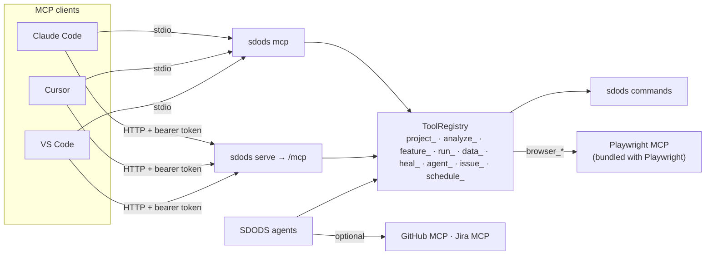

<Learn>
  How to connect an MCP client to SDODS over stdio or HTTP, which tool families exist, how scopes
  gate them, and how a project declares external MCP servers for its agents.
</Learn>

## Topology



Browser driving goes **through** SDODS rather than beside it: the `browser_*` tools are the
Playwright MCP tools bound to a project and environment. One server to install.

## Connect

<Tabs items={['Claude Code', 'Cursor', 'VS Code', 'HTTP']}>
<Tab value="Claude Code">
```bash
claude mcp add sdods -- npx sdods mcp --project demo-shop --env staging
```
</Tab>
<Tab value="Cursor">
```json title=".cursor/mcp.json"
{ "mcpServers": { "sdods": { "command": "npx", "args": ["sdods", "mcp", "--project", "demo-shop"] } } }
```
</Tab>
<Tab value="VS Code">
```json title=".vscode/mcp.json"
{ "servers": { "sdods": { "type": "stdio", "command": "npx", "args": ["sdods", "mcp", "--project", "demo-shop"] } } }
```
</Tab>
<Tab value="HTTP">
```bash
claude mcp add --transport http sdods https://sdods.example.com/mcp --header "Authorization: Bearer $SDODS_TOKEN"
```
</Tab>
</Tabs>

`sdods mcp install claude|cursor|vscode` writes these files for you.

<Screenshot
  src="/screenshots/ui/settings-mcp.png"
  alt="Settings → MCP clients: endpoint, tool list, install snippets and a connection test"
  caption="Settings → MCP clients in the web UI: the endpoint, the tool catalogue and copy-ready client snippets."
/>

## Tool families

| Prefix                 | Examples                                                                                                                                                             |
| ---------------------- | -------------------------------------------------------------------------------------------------------------------------------------------------------------------- |
| `project_`             | `project_list`, `project_get_config`, `project_list_envs`, `project_doctor`                                                                                          |
| `analyze_`             | `analyze_project`, `analyze_routes`, `analyze_openapi`, `analyze_locators`, `analyze_coverage`, `analyze_best_practices`, `analyze_change_impact`, `analyze_failure` |
| `feature_` / `step_`   | `feature_list`, `feature_read`, `feature_write` (proposal), `feature_lint`, `step_list`, `step_find`                                                                 |
| `run_`                 | `run_tests`, `run_get`, `run_get_scenario`, `run_list`, `run_cancel`, `run_har_replay`                                                                               |
| `data_`                | `data_list_datasets`, `data_load`, `data_pool_status`                                                                                                                |
| `heal_` / `insights_`  | `heal_events`, `heal_locator_stats`, `insights_flaky`, `insights_health`                                                                                             |
| `record_`              | `record_start` (local only), `record_convert`, `auth_capture`                                                                                                        |
| `agent_` / `proposal_` | `agent_plan`, `agent_generate`, `agent_heal`, `proposal_list`, `proposal_accept`                                                                                     |
| `issue_` / `schedule_` | `issue_create`, `issue_link`, `schedule_list`, `schedule_run_now`                                                                                                    |

Write tools produce proposals; they never touch your working tree. Every tool carries annotations, a Zod input schema and a link to its reference page.

## Scopes

Over HTTP the bearer token's scopes decide which tools appear: `viewer` tokens see read tools, `editor` tokens add run and proposal tools, `admin` tokens everything. Over stdio you are the local admin.

## Servers a project consumes

```yaml title="sdods.project.yaml"
mcp:
  servers:
    github:
      transport: stdio
      command: npx
      args: [-y, '@modelcontextprotocol/server-github']
      envFrom: { GITHUB_PERSONAL_ACCESS_TOKEN: GITHUB_TOKEN }
      allowedTools: [search_issues, create_issue]
```

Values under `envFrom` and `headersFrom` are variable names; literals are rejected.

Every adapter can now reach these servers, not only the Claude and CLI ones. A chat-completions
adapter — `openai-compatible` or `ollama` — connects each server as an MCP client and presents its
tools as ordinary functions named `mcp__<server>__<tool>`, the same convention Claude Code uses. A
server that fails to start is reported and skipped rather than taking the job with it.

The roles whose work is looking at the application (planner, generator, healer) also get
Playwright's own MCP server attached automatically, so “write a test for this page” means the same
thing on a local model as it does on a hosted one.

<Callout type="warn">
  Tool count is the limit, not the transport. SDODS exposes 33–35 tools to a role and Playwright
  adds about 24; a 7–8B local model starts describing tool calls in prose instead of making them
  somewhere past that. Narrow `allowedTools`, or use a larger model for the roles that drive a
  browser — see [Local models](/docs/guides/local-models/).
</Callout>

## Next steps

- [MCP tools reference](/docs/reference/mcp-tools)
- [Agents](/docs/guides/agents)
