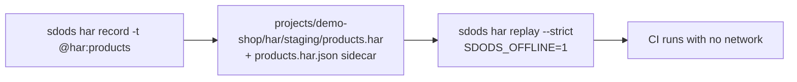

<Learn>
How the mock step answers requests with inline JSON, how `@har:<name>` records and replays network traffic per environment, how strict and offline modes work, and how API-layer scenarios replay without a browser.
</Learn>

## Inline mocks

```gherkin
When I mock "**/api/banner" with JSON:
  """json
  { "text": "Welcome {{username}}" }
  """
```

## HAR record and replay



```gherkin
@ui @smoke @har:products
Scenario: Products render from recorded traffic
  Given I am on the inventory page
  Then I should see the text "Sauce Labs Backpack"
```

```bash
bun run sdods har record -p demo-shop -e staging -t @har:products     # update mode
bun run sdods har replay -p demo-shop -e staging --strict              # abort on any request not in the file
bun run sdods har list -p demo-shop
```

| Mode   | `SDODS_HAR_MODE`                        | Behaviour                                                                        |
| ------ | --------------------------------------- | -------------------------------------------------------------------------------- |
| off    | `off`                                   | no HAR routing                                                                   |
| update | `update`                                | requests go to the network and the file is rewritten                             |
| replay | `replay` (default when the file exists) | responses come from the file; misses fall through unless `:strict` or `--strict` |

`SDODS_OFFLINE=1` additionally aborts every request the HAR does not answer, which is how CI proves a suite has no hidden network dependency.

## API layer

Browser-level HAR routing only exists for pages and browser contexts, so the API client implements its own recorder and replayer keyed by method, normalised URL and body hash. The same `@har:<name>` tag drives both.

## Next steps

- [Record and playback](/docs/guides/record-and-playback)
- [Sharding and CI](/docs/guides/sharding-and-ci)
