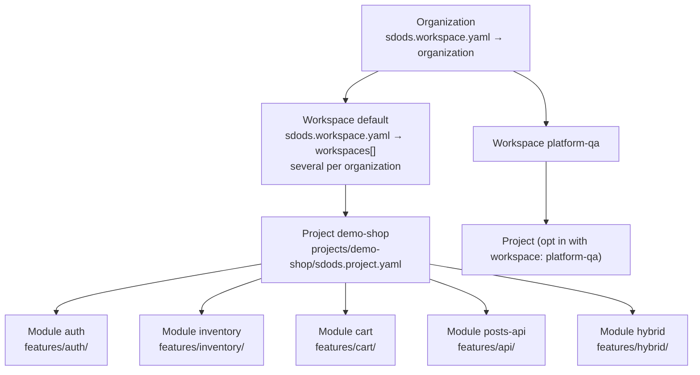

<Learn>
  How organizations, workspaces, projects and modules nest, which file declares each level, what a
  module adds on top of a features folder, and how the demo project is modelled.
</Learn>

## The hierarchy



| Level        | Declared in                             | Holds                                                                                                                                                                                                                                                    |
| ------------ | --------------------------------------- | -------------------------------------------------------------------------------------------------------------------------------------------------------------------------------------------------------------------------------------------------------- |
| Organization | `sdods.workspace.yaml` → `organization` | a company or product line; membership roles `member`, `admin`, `owner`                                                                                                                                                                                   |
| Workspace    | `sdods.workspace.yaml` → `workspaces[]` | a team or product area; an organization holds many, and `defaultWorkspace` names the one projects join unless they set `workspace:`; defaults for browsers, suites, test-id attribute and shared processes; membership roles `viewer`, `editor`, `admin` |
| Project      | `projects/<slug>/sdods.project.yaml`    | one application: layers, browsers, environments, data, auth, screenshots, modules, processes                                                                                                                                                             |
| Module       | `modules:` inside the project YAML      | one functional area: a folder under `features/`, its testing types, expected tags, owner, Jira component, routes and endpoints                                                                                                                           |

## The workspace file

```yaml title="sdods.workspace.yaml"
organization:
  slug: sdods
  name: SDODS
  url: https://example.com/sdods
workspaces:
  - slug: default
    name: Default workspace
    organization: sdods
  - slug: platform-qa
    name: Platform QA
    organization: sdods
defaultWorkspace: default
defaults:
  browsers: [chromium, firefox, webkit]
  suites: [smoke, regression, sanity]
  testIdAttribute: data-testid
  processes:
    - {
        name: pr-check,
        trigger: pr,
        tags: '@smoke',
        browsers: [chromium],
        harMode: replay,
        gates: { minPassRate: 100 },
      }
```

Projects inherit `defaults` and may override any of them. A project joins a workspace with `workspace: <slug>` (one of `workspaces[]`); when omitted it joins `defaultWorkspace`. `organization:` must match the file's organization. `sdods workspace tree` prints the result, and `sdods db sync` mirrors it into the database so the web UI can show workspaces with each user's effective role. Creating a workspace on the web UI's Workspaces page (organization owners and admins) appends it to `workspaces[]` in this file and then syncs, so projects can join it straight away; commit the file change to keep it.

## Modules

```yaml title="projects/demo-shop/sdods.project.yaml"
organization: sdods
workspace: default
modules:
  - name: auth
    title: Authentication
    path: auth # features/auth/ (default: the module name)
    layers: [ui]
    testingTypes: [functional, smoke, regression, data-driven]
    tags: ['@auth']
    routes: [login]
  - name: inventory
    title: Inventory
    path: inventory
    layers: [ui]
    testingTypes: [functional, regression, visual, accessibility]
    tags: ['@inventory']
    routes: [inventory]
  - name: cart
    title: Cart
    path: cart
    layers: [ui]
    testingTypes: [functional, regression]
    tags: ['@cart']
    routes: [cart, checkout]
  - name: posts-api
    title: Posts API
    path: api
    layers: [api]
    testingTypes: [functional, contract, smoke, regression]
    tags: ['@posts']
    endpoints: ['/posts', '/posts/{id}', '/posts/{id}/comments']
  - name: hybrid
    title: Hybrid flows
    path: hybrid
    layers: [hybrid]
    testingTypes: [integration]
    tags: ['@hybrid-demo']
```

What a module gives you:

- **Lint** warns when a scenario under `features/<module>/` lacks one of the module's expected `tags`.
- **Coverage** joins `routes` and `endpoints` with scenarios per suite tag.
- **Run selection**: `sdods run -p demo-shop --module cart` runs one module; processes may list `modules:`.
- **Reporting**: runs, scenario trees and insights group by module, in the CLI and the web UI.

<Callout type="info">
  `owner` and `jiraComponent` are stored and synced to the database, but nothing consumes them yet —
  they do not appear on created GitHub or Jira issues today. Set them if you want the metadata in
  place; do not expect them to route anything.
</Callout>

## How modules are detected

`sdods analyze` proposes the `modules:` block for you. It does not group by URL, because a URL often
says nothing about the domain: in the workshop application `POST /` is the bank-account endpoint and
`/contacts` plus `/personal` are both transaction screens. Instead several signals vote, and the
strongest one wins each route:

| Signal          | Weight | What it reads                                                                                    |
| --------------- | ------ | ------------------------------------------------------------------------------------------------ |
| `openapi-tag`   | 1.00   | the `tags` on an OpenAPI operation                                                               |
| `workspace`     | 0.90   | the monorepo package owning the file (`pnpm-workspace.yaml`, `turbo.json`, `nx.json`)            |
| `domain-dir`    | 0.80   | `src/modules/<x>/`, `src/features/<x>/`, `src/domains/<x>/`, `services/<x>/`                     |
| `source-file`   | 0.70   | the file that defines the route — `auth.ts`, `user-routes.ts`, `UserController.java`             |
| `route-segment` | 0.30   | the first URL segment, as a floor so nothing is left unassigned                                  |
| `alias`         | 0.20   | folds `login`, `signin`, `logout`, `session` and friends onto `auth`; merges only, never creates |

Role suffixes are stripped (`bankaccount-routes.ts` → `bankaccount`), PascalCase is split
(`TransactionsContainer.tsx` → `transactions`), and file-router parameters are skipped so
`app/products/[id]/page.tsx` becomes `products`, not `id`. A file that names a role rather than a
domain (`app.ts`, `index.ts`, `page.tsx`) yields nothing and lets a weaker signal decide.

Routes that cannot name anything — catch-alls (`/*`), optional groups (`/(public)?`) and a bare
root in a generic file — are skipped and listed, rather than collected into a `home` bucket. A path
that is uninformative on its own is still kept when its file names a domain: `GET /{username}` in
`contact-routes.ts` is the `contact` module.

The proposal prints the winning signal, the confidence and the file behind every module, so you can
judge it before writing anything. See
[the workshop's first chapter](/docs/workshop/analyze-and-apply#how-modules-are-decided).

<Callout type="info">
  A module is metadata over a folder. Nothing stops you from starting with the plain `features/ui`,
  `features/api`, `features/hybrid` layout and adding modules when a project grows.
</Callout>

## Next steps

- [Processes and testing types](/docs/guides/processes-and-testing-types)
- [Workspace file reference](/docs/reference/project-yaml#sdodsworkspaceyaml)
