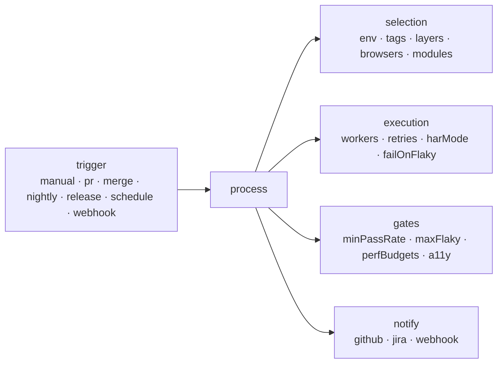

<Learn>
  What a process is, the fields it takes, how the four demo processes differ, how to run one, and
  which testing types a module can declare.
</Learn>

## Testing types

A module declares the kinds of testing it receives. Lint and coverage use the list to spot gaps (a module with `visual` but no `@visual` scenario, for example).

| Type            | Typical tag            | Meaning                                     |
| --------------- | ---------------------- | ------------------------------------------- |
| `functional`    | `@smoke` `@regression` | behaviour of a feature                      |
| `smoke`         | `@smoke`               | fast health checks                          |
| `regression`    | `@regression`          | the full behavioural suite                  |
| `sanity`        | `@sanity`              | narrow checks after a change                |
| `integration`   | `@hybrid`              | several components or layers together       |
| `contract`      | `@api` + schema steps  | responses match OpenAPI, JSON Schema or Zod |
| `visual`        | `@visual`              | pixel comparison against baselines          |
| `accessibility` | `@a11y`                | axe-core violations                         |
| `performance`   | `@perf`                | web-vitals and API latency budgets          |
| `security`      | `@security`            | authorization and input-handling checks     |
| `data-driven`   | `@data-driven`         | outlines and datasets                       |
| `exploratory`   | `@recorded`            | recorded sessions before conversion         |

## Processes

A process is a named run recipe. It captures what a team runs on which occasion so nobody retypes flags.



```yaml title="projects/demo-shop/sdods.project.yaml"
processes:
  - name: pr-check
    title: Pull request check
    trigger: pr
    tags: '@smoke'
    browsers: [chromium]
    harMode: replay
    gates: { minPassRate: 100 }
  - name: nightly-regression
    title: Nightly regression
    trigger: nightly
    tags: '@regression'
    browsers: [chromium, firefox, webkit]
    notify: [github]
  - name: release-gate
    title: Release gate
    trigger: release
    tags: '@smoke or @regression'
    browsers: [chromium, firefox, webkit]
    failOnFlaky: true
    gates: { minPassRate: 100, maxFlaky: 0, perfBudgets: true, a11y: true }
  - name: api-contract
    title: API contract
    trigger: merge
    layers: [api]
    tags: '@contract or @smoke'
```

The workspace file declares the same `pr-check`, `nightly-regression` (with `schedule: '0 2 * * *'`) and `release-gate` under `defaults.processes`; the project's entries override them by name, so `sdods processes list -p demo-shop` shows four processes.

| Field                                          | Purpose                                                                                                                 |
| ---------------------------------------------- | ----------------------------------------------------------------------------------------------------------------------- |
| `trigger`                                      | when the process is meant to run: `manual`, `pr`, `merge`, `nightly`, `release`, `schedule`, `webhook`                  |
| `env`, `tags`, `layers`, `browsers`, `modules` | what to select                                                                                                          |
| `workers`, `retries`, `harMode`, `failOnFlaky` | how to execute                                                                                                          |
| `gates`                                        | conditions `sdods run --process` checks after the run, failing it even when every scenario passed (see [Gates](#gates)) |
| `notify`                                       | integrations to call after the run                                                                                      |
| `schedule`                                     | a cron expression; `sdods schedule sync` turns it into a schedule                                                       |

Workspace-level processes under `defaults.processes` apply to every project; a project process with the same name overrides it.

## Run a process

```bash
bun run sdods processes list -p demo-shop
bun run sdods run -p demo-shop --process pr-check
bun run sdods run -p demo-shop --process nightly-regression -b chromium    # flags override process fields
bun run sdods run -p demo-shop --module cart -t @regression
```

CI workflows call processes by name, so a change of gate or browser list is a YAML edit, not a workflow edit.

## Gates

`sdods run --process <name>` evaluates the process's `gates` against the run it just finished, prints one row per gate and exits `1` with `GATE_FAILED` when any gate is not met:

| Gate          | Passes when                                                                                          |
| ------------- | ---------------------------------------------------------------------------------------------------- |
| `minPassRate` | (passed + flaky) ÷ (total − skipped) × 100 is at least the value. A run that executed nothing fails. |
| `maxFlaky`    | no more scenarios than the value failed first and passed on a retry                                  |
| `a11y`        | at least one `@a11y` audit ran and none found a violation at or above `a11y.failOn`                  |
| `perfBudgets` | at least one `@perf` scenario was judged against a budget and none breached one                      |

The verdict is written to `gates.json` in the run directory and added to `summary.json` and the `--json` output. Ingest records it on the run, whether the CLI or the server started the run, and marks a gated-out run failed. The run page in the web UI shows the gate table.

A sharded run (`--shard i/n`) is not gated per shard, because one shard is not the whole run. The gates are judged where the shards are merged:

```bash
sdods report merge --run gh-123 --process release-gate .sdods/runs/gh-123/shard-reports
```

`report merge --process` reads the merged results and the shards' `@a11y` and `@perf` reports, prints the same table and exits `1` with `GATE_FAILED`. See [Sharding and CI](/docs/guides/sharding-and-ci#gate-a-sharded-run). What `@a11y` and `@perf` check is described in [Accessibility and performance budgets](/docs/guides/accessibility-and-performance).

## Next steps

- [Sharding and CI](/docs/guides/sharding-and-ci)
- [Scheduling](/docs/guides/scheduling)
