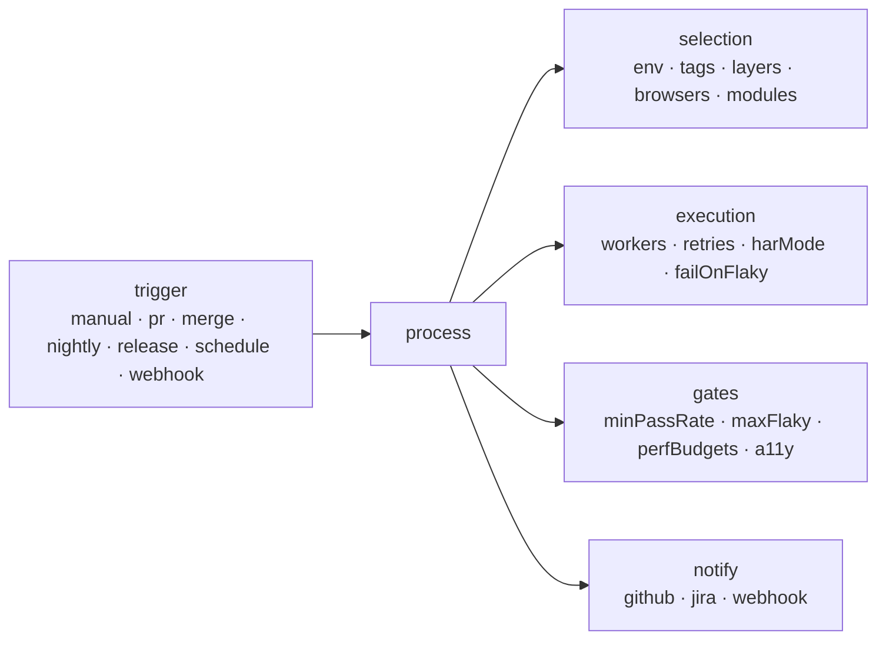

<Learn>
  What a process is, the fields it takes, how the four demo processes differ, how to run one, and
  which testing types a module can declare.
</Learn>

## Testing types

A module declares the kinds of testing it receives. Lint and coverage use the list to spot gaps (a module with `visual` but no `@visual` scenario, for example).

| Type            | Typical tag            | Meaning                                     |
| --------------- | ---------------------- | ------------------------------------------- |
| `functional`    | `@smoke` `@regression` | behaviour of a feature                      |
| `smoke`         | `@smoke`               | fast health checks                          |
| `regression`    | `@regression`          | the full behavioural suite                  |
| `sanity`        | `@sanity`              | narrow checks after a change                |
| `integration`   | `@hybrid`              | several components or layers together       |
| `contract`      | `@api` + schema steps  | responses match OpenAPI, JSON Schema or Zod |
| `visual`        | `@visual`              | pixel comparison against baselines          |
| `accessibility` | `@a11y`                | axe-core violations                         |
| `performance`   | `@perf`                | web-vitals and API latency budgets          |
| `security`      | `@security`            | authorization and input-handling checks     |
| `data-driven`   | `@data-driven`         | outlines and datasets                       |
| `exploratory`   | `@recorded`            | recorded sessions before conversion         |

## Processes

A process is a named run recipe. It captures what a team runs on which occasion so nobody retypes flags.



```yaml title="projects/demo-shop/automax.project.yaml"
processes:
  - name: pr-check
    title: Pull request check
    trigger: pr
    env: staging
    tags: '@smoke'
    browsers: [chromium]
    harMode: replay
    gates: { minPassRate: 100 }
    notify: [github]
  - name: nightly-regression
    trigger: nightly
    tags: '@regression'
    browsers: [chromium, firefox, webkit]
    retries: 2
    schedule: '0 2 * * *'
    notify: [github, jira]
  - name: release-gate
    trigger: release
    tags: '@smoke or @regression'
    failOnFlaky: true
    gates: { minPassRate: 100, maxFlaky: 0, perfBudgets: true, a11y: true }
  - name: api-contract
    trigger: merge
    layers: [api]
    modules: [posts-api]
    tags: '@api'
    gates: { minPassRate: 100 }
```

| Field                                          | Purpose                                                                                                                                  |
| ---------------------------------------------- | ---------------------------------------------------------------------------------------------------------------------------------------- |
| `trigger`                                      | when the process is meant to run: `manual`, `pr`, `merge`, `nightly`, `release`, `schedule`, `webhook`                                   |
| `env`, `tags`, `layers`, `browsers`, `modules` | what to select                                                                                                                           |
| `workers`, `retries`, `harMode`, `failOnFlaky` | how to execute                                                                                                                           |
| `gates`                                        | conditions that fail the run even when every scenario passed: minimum pass rate, maximum flaky count, performance budgets, accessibility |
| `notify`                                       | integrations to call after the run                                                                                                       |
| `schedule`                                     | a cron expression; `automax schedule sync` turns it into a schedule                                                                      |

Workspace-level processes under `defaults.processes` apply to every project; a project process with the same name overrides it.

## Run a process

```bash
bun run automax processes list -p demo-shop
bun run automax run -p demo-shop --process pr-check
bun run automax run -p demo-shop --process nightly-regression -b chromium    # flags override process fields
bun run automax run -p demo-shop --module cart -t @regression
```

<Planned phase={12} />

CI workflows call processes by name, so a change of gate or browser list is a YAML edit, not a workflow edit.

## Next steps

- [Sharding and CI](/docs/guides/sharding-and-ci)
- [Scheduling](/docs/guides/scheduling)
