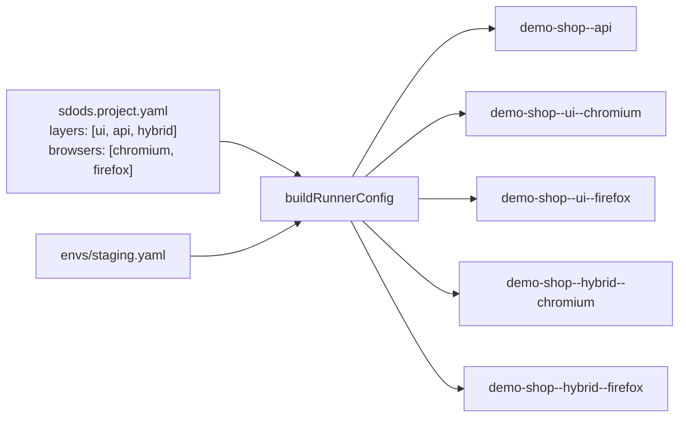

<Learn>
  What lives in a project directory, how environment files describe targets, how run targets are
  generated from them, and which commands create and inspect both.
</Learn>

## A project is a directory

```text
projects/demo-shop/
  sdods.project.yaml     # identity, layers, browsers, tags, routes, data, auth, screenshots, heal, modules, processes
  envs/staging.yaml        # base URLs, API auth (${VAR}), pool size, locale, per-env overrides
  envs/local.yaml
  .env.staging             # secrets (gitignored); .env.example documents the names
  features/                # Gherkin, one folder per module (ui/, api/, hybrid/ or auth/, cart/ ...)
  steps/fixtures.ts        # extends the SDODS test with your auth strategy and page objects
  steps/*.steps.ts         # project-specific steps
  pages/*.ts               # page objects with decorators
  data/common/  data/staging/  data/factories.ts
  recorded/  har/  .auth/
```

The `slug` inside the YAML must equal the directory name; `sdods config validate` checks it.

## Environments

An environment is one target of the same application. Each has a file under `envs/`:

```yaml title="projects/demo-shop/envs/staging.yaml"
name: staging
ui:
  baseUrl: https://www.saucedemo.com
api:
  baseUrl: https://jsonplaceholder.typicode.com
  headers: { Accept: application/json }
  auth: { type: none } # or bearer/basic/header/oauth-client-credentials with ${VAR}
users:
  poolSize: 4
vars:
  defaultProduct: Sauce Labs Backpack
  standardPassword: '${DEMO_SHOP_PASSWORD:-secret_sauce}'
use:
  locale: en-US
  timezoneId: America/New_York
screenshots: { onlyOnFailure: false } # overrides the project section for this env
```

The project lists which environments exist and which is the default:

```yaml
envs:
  default: staging
  available: [local, staging]
```

## From YAML to run targets



For each layer, specs are generated once; each browser is a run target that reuses the generated files. The `api` target has no browser device. Run `sdods run -p demo-shop --list` to print the names.

## Commands

```bash sdods-verify
bun run sdods project list
bun run sdods env list -p demo-shop
bun run sdods config show -p demo-shop -e staging --explain
```

```bash
bun run sdods project create billing --ui-url http://localhost:3000 --api-url http://localhost:3000/api --env local
bun run sdods env add staging -p billing --ui-url https://billing-staging.example.com --api-url https://api-staging.example.com
```

<Callout type="warn">
  Every environment must be listed in `envs.available` **and** have a file under `envs/`. `sdods
  doctor` reports both kinds of mismatch.
</Callout>

## Next steps

- [Configuration precedence](/docs/guides/configuration)
- [Organizations, workspaces, projects and modules](/docs/guides/organizations-workspaces-modules)
