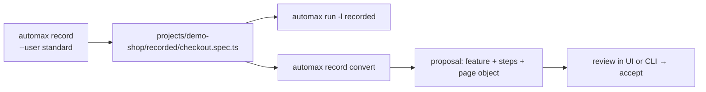

<Learn>
  How `automax record` wraps Playwright codegen with your project's environment, test-id attribute
  and a logged-in pool user, what post-processing does, how recorded specs run, and how conversion
  to features stays reviewable.
</Learn>

## The flow



## Record

```bash
bun run automax record -p demo-shop -e staging --name checkout --user standard
bun run automax record -p demo-shop -e staging --name mobile-checkout --device "iPhone 15"
bun run automax record -p demo-shop -e staging --name api-capture --save-har
```

Under the hood AutoMax spawns `npx playwright codegen` with `--target playwright-test`, the environment's base URL, `--test-id-attribute` from the project, `--load-storage` for the leased user, and device, locale, timezone, geolocation and color-scheme options from the environment. `context._enableRecorder` is never used; only public Playwright surfaces are.

## Post-processing

The generated spec is rewritten so it fits the project:

- imports `test` and `expect` from `@automax/core/test`, so fixtures, screenshots and healing apply
- absolute URLs on the environment origin become relative routes
- the test is wrapped in `test.describe` with `@recorded @ui @regression` tags
- a header comment records project, environment, user, device and Playwright version
- CSS and XPath locators are flagged `// automax:fragile` for the reviewer

`--no-post-process` keeps the raw output.

## Run recorded specs

```bash
bun run automax run -p demo-shop -e staging -l recorded -b chromium
```

`recorded` is a layer like the others; results ingest through the Playwright JSON reporter.

## Convert to Gherkin

```bash
bun run automax record convert projects/demo-shop/recorded/checkout.spec.ts
bun run automax proposals list
bun run automax proposals accept <id>
```

The generator agent reuses existing steps first, adds steps only for unmatched actions, and never deletes the spec. See [Agents](/docs/guides/agents).

## Next steps

- [Record and playback with roles and environments](/docs/guides/record-playback-roles-environments)
- [Network mocking and HAR](/docs/guides/network-mocking-and-har)
