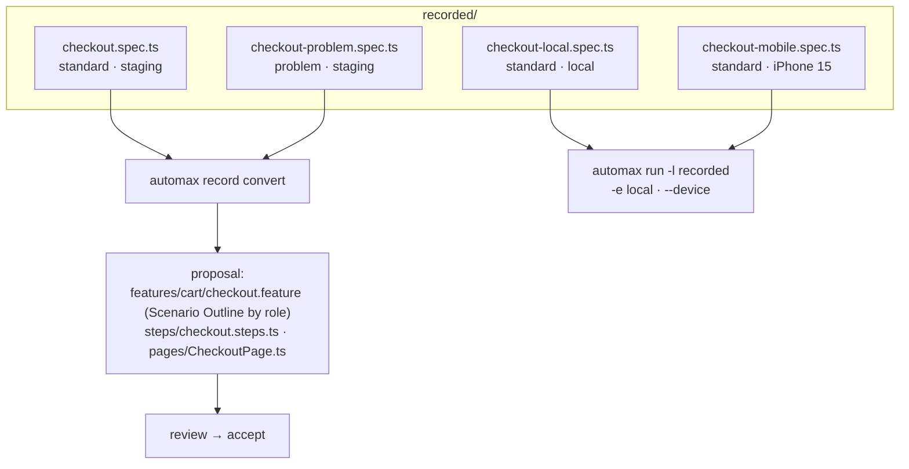

<Learn>
How to record one flow several times as different pool users, against different environments and device profiles, how to keep those recordings organised, how conversion produces a single data-driven feature, and which Claude Code skills package the routine.
</Learn>

## Why re-record

A checkout looks different for a standard user, a locked-out user and an admin; it also differs on a phone. Recording each variant with a leased pool user gives you honest fixtures for every role without hand-editing logins.

## One flow, many recordings

<Steps>
<Step>
### Record as a standard user on staging

```bash
bun run automax record -p demo-shop -e staging --user standard --name checkout
```
</Step>
<Step>
### Record as a problem user

```bash
bun run automax record -p demo-shop -e staging --user problem --name checkout-problem
```

The pool leases `problem_user`, applies its cached storage state (capturing it first if needed), and codegen starts logged in.
</Step>
<Step>
### Record against local

```bash
bun run automax record -p demo-shop -e local --user standard --name checkout-local
```

Base URL, locale and timezone come from `envs/local.yaml`; the spec still uses route names, so it runs on staging too.
</Step>
<Step>
### Record on a phone profile

```bash
bun run automax record -p demo-shop -e staging --user standard --device "iPhone 15" --name checkout-mobile
```
</Step>
</Steps>



## Run the recordings

```bash
bun run automax run -p demo-shop -e staging -l recorded
bun run automax run -p demo-shop -e local   -l recorded
bun run automax run -p demo-shop -e staging -l recorded --device "iPhone 15"
```

## Convert into one data-driven feature

```bash
bun run automax record convert projects/demo-shop/recorded/checkout.spec.ts projects/demo-shop/recorded/checkout-problem.spec.ts
```

When several recordings share a flow, the generator proposes a Scenario Outline whose examples carry the role, and uses `Given I use a leased user with role "<role>"` so the feature keeps working as the pool changes:

```gherkin
@ui @regression @pool
Feature: Checkout
  Scenario Outline: <role> completes checkout
    Given I use a leased user with role "<role>"
    And I am on the inventory page
    When I add "{{defaultProduct}}" to the cart
    And I check out with "{{firstName}}" "{{lastName}}" "{{postalCode}}"
    Then I should see the text "<outcome>"
    # title-format: <role> → <outcome>
    Examples:
      | role     | outcome                       |
      | standard | Thank you for your order!     |
      | problem  | Error: Last Name is required  |
```

Review the proposal, then `automax proposals accept <id>`.

## Claude Code skills

Two reusable skills ship with the repository so an assistant can run this routine end to end:

- `.claude/skills/automax-record/SKILL.md` — records a flow for a given project, environment, role and device, post-processes it, runs it once and opens a conversion proposal
- `.claude/skills/automax-run/SKILL.md` — runs a project by tag, layer, browser or process, reads the summary and the run directory, and reports failures with their before/after screenshots

Invoke them in Claude Code with `/automax-record` and `/automax-run`, or let the MCP `record_start` and `run_tests` tools do the same from other clients.

## Next steps

- [Auth strategies and storage state](/docs/guides/auth-and-storage-state)
- [Agents](/docs/guides/agents)
