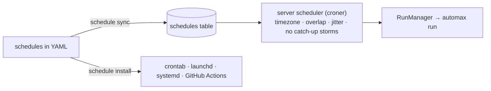

<Learn>
How schedules are declared, how the server executes them with overlap and jitter rules, and how to export them when you run without a server.
</Learn>

```yaml title="automax.project.yaml"
schedules:
  - name: smoke-hourly
    cron: '0 * * * *'
    timezone: UTC
    tags: '@smoke'
    browsers: [chromium]
    harMode: replay
    overlap: skip
  - name: nightly-matrix
    cron: '0 2 * * *'
    timezone: America/New_York
    tags: '@regression'
    browsers: [chromium, firefox, webkit]
    notify: [github]
```

A process with a `schedule:` field becomes a schedule too after `automax schedule sync`.



```bash
bun run automax schedule add -p demo-shop --name nightly --cron "0 2 * * *" --tz America/New_York -t @regression -b chromium -b firefox --notify github
bun run automax schedule list -p demo-shop
bun run automax schedule next -p demo-shop --count 5
bun run automax schedule run-now nightly
bun run automax schedule install --target github
```

<Planned phase={9} />

## Next steps

- [Processes and testing types](/docs/guides/processes-and-testing-types)
- [Sharding and CI](/docs/guides/sharding-and-ci)
