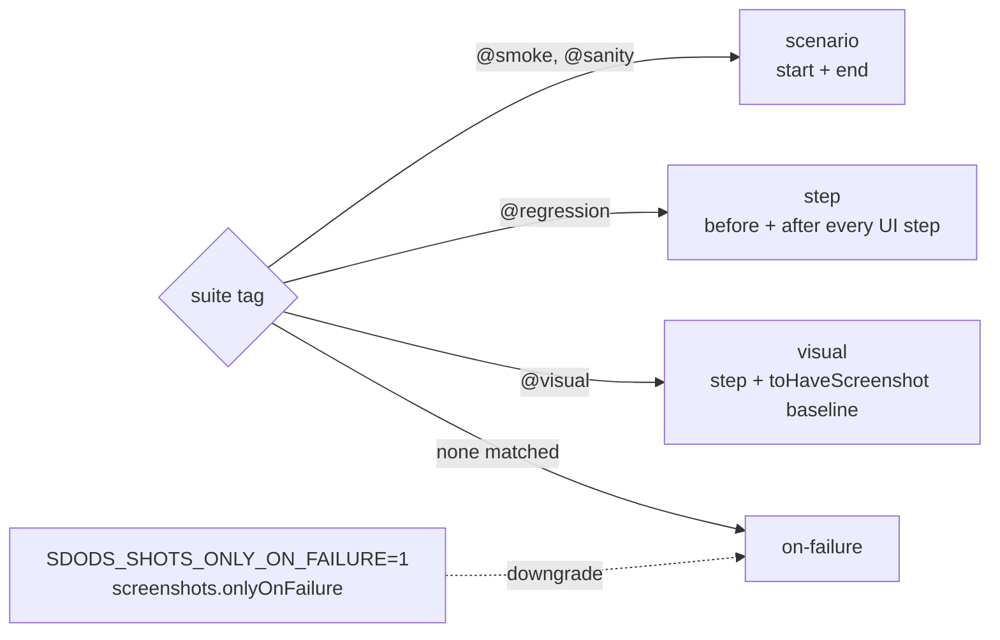

<Learn>
  The screenshot policies, how a tag selects one, how before and after captures are named and
  stored, how to control cost, and how `@visual` compares against per-browser baselines.
</Learn>

## Policy by tag



```yaml title="sdods.project.yaml"
screenshots:
  policy:
    default: on-failure
    '@smoke': scenario
    '@regression': step
    '@visual': visual
  fullPage: false
  mask: ['[data-test="shopping-cart-badge"]']
  viewport: { width: 1280, height: 720 }
  onlyOnFailure: false
```

An environment file may override the section, for example `screenshots: { onlyOnFailure: true }` on a slow CI target.

## Files and attachments

```text
.sdods/runs/<runId>/demo-shop/<fingerprint>/r0/
  scenario-start.png
  03-before.png   03-after.png
  scenario-end.png
  failure.png
```

Each file is also attached to the test with a stable name (`sdods/shot/step/03/before`), which is what the database ingest and the run viewer pair up. API steps attach `request.json` and `response.json` instead.

## Sample output

The images below are copied from the latest demo run when the docs are built (scenario "Add a product to the cart", chromium, policy `step`).

<Screenshot
  src="/screenshots/step-03-before.png"
  alt="Before: the inventory page before adding a product to the cart"
  caption="03-before.png"
/>
<Screenshot
  src="/screenshots/step-03-after.png"
  alt="After: the cart badge shows one item"
  caption="03-after.png"
/>
<Screenshot
  src="/screenshots/scenario-end.png"
  alt="Scenario end capture"
  caption="scenario-end.png — every policy except on-failure records the end state"
/>

## Visual baselines

```gherkin
@ui @regression @visual
Scenario: Inventory page matches the baseline
  Given I am on the inventory page
  Then the page should match the visual baseline "inventory"
```

Baselines live under `projects/<slug>/features/__screenshots__/<browser>/` and are created or refreshed with `--update-snapshots`. The `mask` selectors and `animations: disabled` apply to every capture so dynamic regions do not fail the comparison.

## Cost control

- `onlyOnFailure: true` (or the environment variable) keeps the visual baseline check but drops step captures.
- Captures are skipped when a step made only API calls and the URL did not change.
- Videos and traces stay on the `retain-on-failure` and `on-first-retry` settings.

## Next steps

- [View results](/docs/getting-started/view-results)
- [File naming reference](/docs/reference/file-naming)
