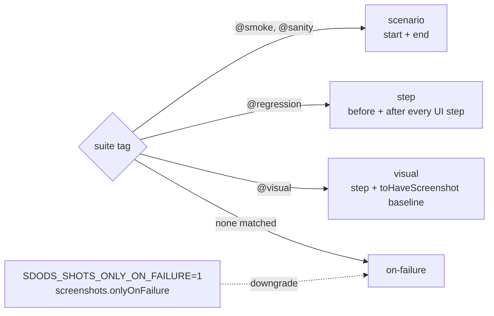

<Learn>
  The screenshot policies, how a tag selects one, how before and after captures are named and
  stored, how to control cost, and how `@visual` compares against per-browser baselines.
</Learn>

## Policy by tag



```yaml title="sdods.project.yaml"
screenshots:
  policy:
    default: on-failure
    '@smoke': scenario
    '@regression': step
    '@visual': visual
  fullPage: false
  mask: ['[data-test="shopping-cart-badge"]']
  maxDiffPixelRatio: 0.01
  baselines:
    inventory: { mask: ['.inventory_item_price'], maxDiffPixelRatio: 0.02 }
  viewport: { width: 1280, height: 720 }
  onlyOnFailure: false
```

An environment file may override the section, for example `screenshots: { onlyOnFailure: true }` on a slow CI target.

## Files and attachments

```text
.sdods/runs/<runId>/demo-shop/<fingerprint>/r0/
  scenario-start.png
  03-before.png   03-after.png
  scenario-end.png
  failure.png
```

Each file is also attached to the test with a stable name (`sdods/shot/step/03/before`), which is what the database ingest and the run viewer pair up. API steps attach `request.json` and `response.json` instead.

## Sample output

The images below are copied from the latest demo run when the docs are built (scenario "Add a product to the cart", chromium, policy `step`).

<Screenshot
  src="/screenshots/step-03-before.png"
  alt="Before: the inventory page before adding a product to the cart"
  caption="03-before.png"
/>
<Screenshot
  src="/screenshots/step-03-after.png"
  alt="After: the cart badge shows one item"
  caption="03-after.png"
/>
<Screenshot
  src="/screenshots/scenario-end.png"
  alt="Scenario end capture"
  caption="scenario-end.png — every policy except on-failure records the end state"
/>

## Visual baselines

```gherkin
@ui @regression @visual
Scenario: Inventory page matches the baseline
  Given I am on the inventory page
  Then the page should match the visual baseline "inventory"
```

A baseline belongs to one run target **and** one platform, because fonts and anti-aliasing differ between macOS and Linux:

```text
projects/<slug>/features/__screenshots__/<run target>/<platform>/<name>.png
projects/demo-shop/features/__screenshots__/demo-shop--ui--chromium/linux/inventory.png
```

The run target is the runner project name (`<slug>--<layer>--<browser>`) and the platform is `darwin`, `linux` or `win32`. A baseline recorded on a laptop never matches a Linux CI runner; see [Linux baselines from CI](#linux-baselines-from-ci).

### Masking and threshold

Every capture hides the selectors in `screenshots.mask`, disables animations and hides the caret. A check fails when more than `maxDiffPixelRatio` of its pixels differ (default `0.01`, one percent). For one baseline, add to both:

- `screenshots.baselines.<name>.mask`: selectors masked **in addition to** `screenshots.mask`.
- `screenshots.baselines.<name>.maxDiffPixelRatio`: replaces the project threshold for that baseline.

`<name>` is the step argument without `.png`. An environment file can override any of these, for example a looser threshold on one target.

To mask something for a single step, use the `masking` variant. The selectors are comma-separated and add to the project and baseline masks:

```gherkin
Then the page should match the visual baseline "inventory" masking "[data-test='shopping-cart-badge'], .footer_copy"
```

A selector that contains a comma itself, such as `:is(a, b)` or `[title="a, b"]`, would be split. Put it in `screenshots.baselines.<name>.mask` instead.

### Reviewing and accepting a changed baseline

When a check fails, the run keeps the expected, actual and diff images and a small record of the failure next to the scenario's screenshots:

```text
.sdods/runs/<runId>/<slug>/<fingerprint>/r<retry>/visual/<run target>/
  inventory-expected.png  inventory-actual.png  inventory-diff.png
  inventory.failure.json
```

Look at what changed, then accept it deliberately:

```bash
sdods baselines diff --run <runId>
```

```bash
sdods baselines accept inventory --run <runId>
```

`accept` copies the **actual** image over the baseline for the platform the run happened on, and prints what it wrote and the diff it accepted. `--all` accepts every failed check of the run. `--run` is required, so an accept always names the run whose pixels it takes. Commit the PNG with the change that moved the pixels. See [`sdods baselines`](/docs/reference/cli-commands/baselines).

In the web UI, a failed visual step shows **Accept as baseline** to editors. The confirmation shows the expected, actual and diff images before anything is written, and then does the same as `sdods baselines accept`.

<Callout type="warn">
  Accepting writes to the project tree, just like `--update-snapshots`. A person reviews the diff
  and runs it; an agent does not.
</Callout>

`sdods run --update-snapshots` still works. It overwrites every baseline it compares without showing a diff, so it prints a warning pointing at `sdods baselines`. Use it only to create baselines for new scenarios in bulk.

### Linux baselines from CI

The nightly `@regression` job in `ci.yml` runs inside `mcr.microsoft.com/playwright:v<version>-noble`, with the version pinned to the repository's exact `@playwright/test`. The `visual-baselines` workflow renders baselines in that same image:

1. Open **Actions → visual-baselines → Run workflow**. Choose the projects (default `demo-shop`), the environment, the browsers and the tag expression (default `@visual`).
2. The workflow runs those scenarios with `--update-snapshots` inside the container. It then opens a pull request that contains only `projects/*/features/__screenshots__/*/linux/*.png`.
3. Review every image in the pull request, then merge it.

The pull request is opened with `GITHUB_TOKEN`, and GitHub does not start workflows for changes that token makes. To run CI on the pull request, push an empty commit to its branch.

A project can only get baselines this way if CI can reach an environment for it. A project that runs against `localhost` needs its app started in the workflow first.

When a nightly run fails a visual check, download its `sdods-<project>-<browser>-<shard>-regression` artifact into `.sdods/runs/`. Then run `sdods baselines diff --run <id>` locally. `accept` writes the Linux baseline, because the record says where the pixels came from.

The monthly `dependencies` workflow moves the image tag whenever it upgrades Playwright, and `tests/playwright-image.test.ts` fails if the image and the client disagree. After an upgrade, re-run `visual-baselines`, because new browser builds can move pixels.

## Cost control

- `onlyOnFailure: true` (or the environment variable) keeps the visual baseline check but drops step captures.
- Captures are skipped when a step made only API calls and the URL did not change.
- Videos and traces stay on the `retain-on-failure` and `on-first-retry` settings.

## Next steps

- [View results](/docs/getting-started/view-results)
- [File naming reference](/docs/reference/file-naming)
- [`sdods baselines`](/docs/reference/cli-commands/baselines)
