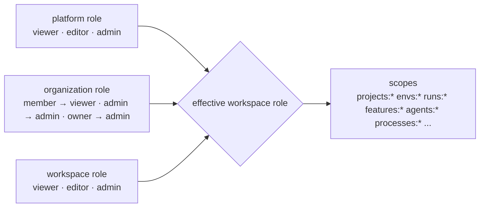

<Learn>
  Where secrets are allowed to live, how free scoped API tokens work, how platform, organization and
  workspace roles combine, and the boundaries agents cannot cross.
</Learn>

## Secrets

- YAML holds `${VAR}` references; a literal secret fails validation.
- `.env` files are parsed into a private map, never into `process.env`.
- Integrations and MCP servers store variable names only.
- Logs, HAR files and screenshots are redacted or masked by key pattern and `mask` selectors.

## API tokens

Tokens are free, unlimited, scoped and revocable. Format `amx_` plus 40 characters; stored as SHA-256; shown once.

```bash
bun run sdods tokens create --user ci --name ingest --scopes runs:ingest,runs:read --expires 90d
bun run sdods tokens list
bun run sdods tokens revoke <id>
```

A token's scopes must be a subset of its owner's role, at creation and at use.

## Roles



The effective role inside a workspace is the higher of the explicit workspace membership and the role implied by organization membership; platform admins are admin everywhere.

| Scope group                                                                                                                     | viewer | editor | admin |
| ------------------------------------------------------------------------------------------------------------------------------- | ------ | ------ | ----- |
| `*:read`, `artifacts:read`                                                                                                      | ✔      | ✔      | ✔     |
| `runs:write`, `runs:ingest`, `features:write`, `datasets:write`, `envs:write`, `schedules:write`, `processes:write`, `agents:*` |        | ✔      | ✔     |
| `users:admin`, `orgs:admin`, `workspaces:write`, `integrations:write`, `audit:read`                                             |        |        | ✔     |

## Sessions

HttpOnly, SameSite=Lax cookies with sliding seven-day expiry; every non-GET request carries a CSRF header; login is rate-limited.

Each user can see and end their own sessions under Settings → Password & sessions: the browser, IP
address, last activity and expiry of every signed-in session, with the current one marked. Changing
a password there requires the current password, is rate-limited, and signs out every other session.
All of these routes refuse API tokens, so a leaked token cannot lock its owner out. Every change is
recorded in the audit log (`user.profile.update`, `user.password.change`, `user.session.revoke`).

## Agents

Agents can read the project, run scenarios and drive a browser. Their only write path is a proposal directory. Nothing reaches `main` without a person accepting it.

## Next steps

- [Reviewing agent proposals](/docs/best-practices/reviewing-proposals)
- [MCP](/docs/guides/mcp)
