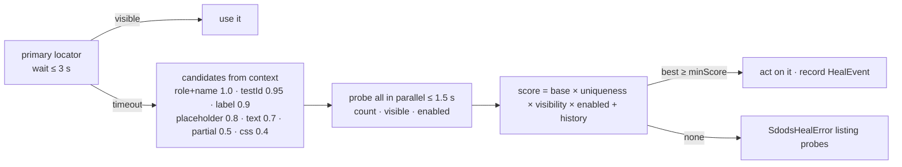

<Learn>
  When healing kicks in, how candidates are built from the context you declare, how they are scored,
  what is recorded, and how repeated heals turn into page-object patches.
</Learn>

## Declare context

```ts
readonly submit = this.heal.locator(this.page.locator('#login-button'), {
  role: 'button', name: 'Login', testId: 'login-button', description: 'login button',
});
```

## Resolution



Worst case adds about 4.5 seconds, not the 30-plus seconds of naive fallback chains. Negative assertions are never healed.

```yaml title="sdods.project.yaml"
heal:
  enabled: true
  primaryTimeoutMs: 3000
  probeTimeoutMs: 1500
  minScore: 0.6
  actions: [click, fill, select, assert, hover, check]
```

## What is recorded

Every heal is attached to the scenario (`sdods/heal/<step>/<n>`), appended to `heal.jsonl` in the run directory, annotated on the test, and logged with the suggested rewrite. With a database, heals feed `heal_events` and `locator_stats`.

```bash
bun run sdods heal report --last
bun run sdods heal report -p demo-shop --write-history
```

## From heal to fix

After three identical successful heals of the same locator, insights produce a page-object patch proposal, deterministically when the page object uses `heal.locator`, otherwise through the healer agent. Review and accept it like any other proposal.

## Next steps

- [Insights and flaky management](/docs/guides/insights-and-flaky)
- [Locator strategy](/docs/best-practices/locator-strategy)
