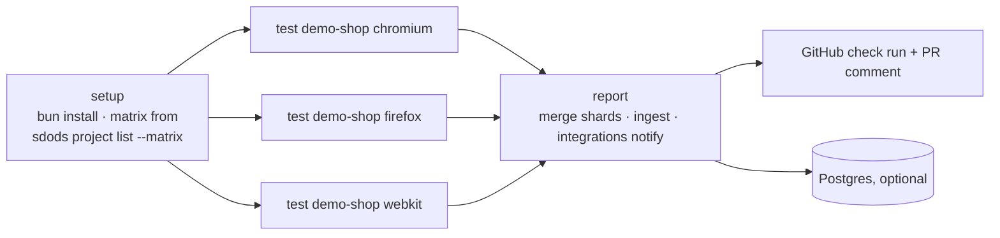

<Learn>
  How `--shard` splits a run, how blob reports merge, what the shipped GitHub Actions workflow does,
  and how results reach the database and the integrations from CI.
</Learn>

## Shard

```bash
bun run sdods run -p demo-shop -e staging -b chromium --shard 1/3 --run-id gh-123 --reporter blob
bun run sdods run -p demo-shop -e staging -b chromium --shard 2/3 --run-id gh-123 --reporter blob
bun run sdods run -p demo-shop -e staging -b chromium --shard 3/3 --run-id gh-123 --reporter blob
sdods report merge --run gh-123 .sdods/runs/gh-123/shard-reports
```

All shards share the `runId`, so user-pool leases stay unique (`shardOffset + parallelIndex`) and ingest merges the NDJSON files of every shard into one run.

## The workflow



`.github/workflows/ci.yml` runs lint, typecheck and unit tests, then the demo project per browser, uploads artifacts, merges reports, ingests when a database or a server token is configured, and calls `sdods integrations notify` with the GitHub token. Pull requests run `@smoke`; `main` runs `@regression`; a nightly job runs the full matrix.

## Offline CI

Tag scenarios with `@har:<name>` and run with `--har-replay --strict` so the pipeline needs no network access to the application. See [Network mocking and HAR](/docs/guides/network-mocking-and-har).

## Ingest from CI

```bash
bun run sdods report ingest --run-id gh-123 .sdods/runs/gh-123/messages*.ndjson          # direct DB
bun run sdods report ingest --run-id gh-123 --server https://sdods.example.com --token $SDODS_TOKEN .sdods/runs/gh-123/messages*.ndjson
```

The second form uploads through the server with a scoped API token, so CI never holds database credentials.

## Next steps

- [GitHub and Jira](/docs/guides/github-and-jira)
- [Processes and testing types](/docs/guides/processes-and-testing-types)
