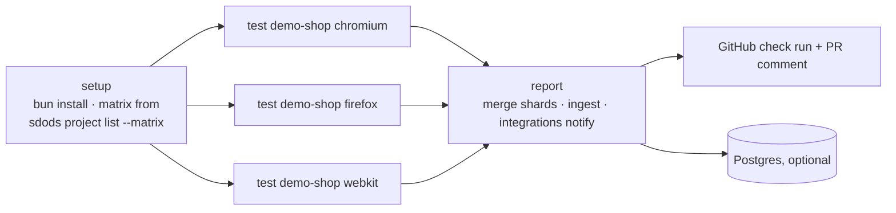

<Learn>
  How `--shard` splits a run, how blob reports merge, what the shipped GitHub Actions workflow does,
  and how results reach the database and the integrations from CI.
</Learn>

## Shard

```bash
bun run sdods run -p demo-shop -e staging -b chromium --shard 1/3 --run-id gh-123 --reporter blob
bun run sdods run -p demo-shop -e staging -b chromium --shard 2/3 --run-id gh-123 --reporter blob
bun run sdods run -p demo-shop -e staging -b chromium --shard 3/3 --run-id gh-123 --reporter blob
sdods report merge --run gh-123 .sdods/runs/gh-123/shard-reports
```

All shards share the `runId`, so user-pool leases stay unique (`shardOffset + parallelIndex`) and ingest merges the NDJSON files of every shard into one run.

## Gate a sharded run

A process's gates are not judged on a single shard. Pass the process to the merge instead. On one machine, give each shard its own run id, because a blob reporter clears its directory when it starts:

```bash
bun run sdods run -p demo-shop -e staging -b chromium --process release-gate --shard 1/2 --run-id gh-123-1 --reporter blob
```

```bash
bun run sdods run -p demo-shop -e staging -b chromium --process release-gate --shard 2/2 --run-id gh-123-2 --reporter blob
```

```bash
sdods report merge --run gh-123-1 --process release-gate .sdods/runs/gh-123-1/shard-reports .sdods/runs/gh-123-2/shard-reports
```

The merge prints the gate table for the whole run, writes `gates.json` into the `--run` directory and exits `1` with `GATE_FAILED` when a gate is not met. Ingest that run afterwards, and the verdict is recorded on it in the database. The `@a11y` and `@perf` evidence is read from the shards' run directories and from the reports attached in the blobs, so a download of the `shard-reports` directories alone is enough. Without `--process`, the merge judges the process named in `run.json`, when that process declares gates.

In a pipeline, point `--run` at the run directory you ingest, and let the merge step's exit code fail the job.

## The workflow



`.github/workflows/ci.yml` runs lint, typecheck and unit tests, then the demo project per browser, uploads artifacts, merges reports, ingests when a database or a server token is configured, and calls `sdods integrations notify` with the GitHub token. `sdods run` notifies enabled integrations on its own at the end of an unsharded run; in a matrix whose report job notifies after merging, pass `--no-notify` to the test jobs so each result is published once. Pull requests run `@smoke`; `main` runs `@regression`; a nightly job runs the full matrix.

## Offline CI

Tag scenarios with `@har:<name>` and run with `--har-replay --strict` so the pipeline needs no network access to the application. See [Network mocking and HAR](/docs/guides/network-mocking-and-har).

## Ingest from CI

```bash
bun run sdods report ingest --run-id gh-123 .sdods/runs/gh-123/messages*.ndjson          # direct DB
bun run sdods report ingest --run-id gh-123 --server https://sdods.example.com --token $SDODS_TOKEN .sdods/runs/gh-123/messages*.ndjson
```

The second form uploads through the server with a scoped API token, so CI never holds database credentials.

## Next steps

- [GitHub and Jira](/docs/guides/github-and-jira)
- [Processes and testing types](/docs/guides/processes-and-testing-types)
