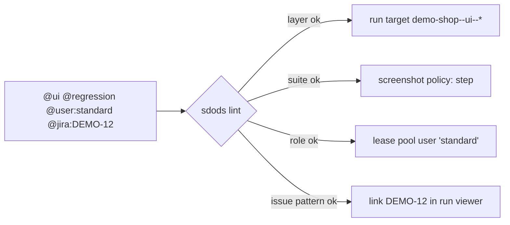

<Learn>
  Which tags are mandatory, which are optional, how value tags are validated against the project
  YAML, how tag expressions filter a run, and how runner control tags pass through.
</Learn>

## The taxonomy

| Tag                                                                       | Rule                                                | Effect                                               |
| ------------------------------------------------------------------------- | --------------------------------------------------- | ---------------------------------------------------- |
| `@ui` `@api` `@hybrid`                                                    | exactly one per scenario                            | selects the layer, therefore the run target          |
| `@smoke` `@regression` `@sanity`                                          | exactly one (list configurable under `tags.suites`) | selects the screenshot policy and the CI gate        |
| `@visual` `@a11y` `@perf` `@mock` `@data-driven` `@pool`                  | optional (declare extras under `tags.extra`)        | enable features                                      |
| `@user:<role>`                                                            | role must exist in `tags.roles`                     | leases a pool user before the browser context starts |
| `@data:<dataset>`                                                         | dataset must exist in `data.sources`                | documents the dataset a scenario depends on          |
| `@har:<name>`                                                             | file must exist under `har/<env>/`                  | replays or records network traffic                   |
| `@env:<name>`                                                             | must be in `envs.available`                         | restricts a scenario to one environment              |
| `@jira:PROJ-123` `@github:123`                                            | pattern-checked                                     | links the scenario to an issue                       |
| `@skip:<browser>`                                                         | browser must be supported                           | excludes the scenario from that engine               |
| `@retries:N` `@timeout:N` `@slow` `@mode:serial` `@skip` `@fixme` `@only` | runner control tags                                 | passed through                                       |

Unknown tags produce a warning, so typos surface without blocking.



## Filter a run

```bash
bun run sdods run -p demo-shop -t @smoke
bun run sdods run -p demo-shop -t "@regression and not @mock"
bun run sdods run -p demo-shop -t smoke,sanity          # shorthand for "@smoke or @sanity"
```

Expressions follow Cucumber tag-expression syntax. SDODS combines your expression with the layer: `(@ui) and (<your expression>)`.

## Lint

```bash
bun run sdods lint -p demo-shop
bun run sdods lint -p demo-shop --json
bun run sdods lint -p demo-shop --fix-tags     # adds a missing layer tag when the folder makes it obvious
```

`sdods run` lints first and stops on errors unless `--no-lint` is given. Exit code `3` means lint errors.

## Next steps

- [Tagging policy](/docs/best-practices/tagging-policy)
- [Processes and testing types](/docs/guides/processes-and-testing-types)
