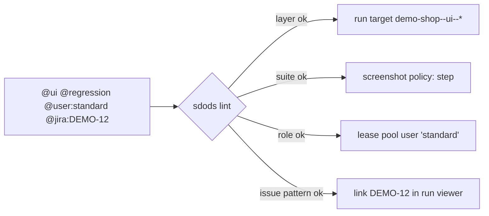

<Learn>
  Which tags are mandatory, which are optional, how value tags are validated against the project
  YAML, how tag expressions filter a run, and how runner control tags pass through.
</Learn>

## The taxonomy

| Tag                                                                       | Rule                                                | Effect                                               |
| ------------------------------------------------------------------------- | --------------------------------------------------- | ---------------------------------------------------- |
| `@ui` `@api` `@hybrid`                                                    | exactly one per scenario                            | selects the layer, therefore the run target          |
| `@smoke` `@regression` `@sanity`                                          | exactly one (list configurable under `tags.suites`) | selects the screenshot policy and the CI gate        |
| `@visual` `@a11y` `@perf` `@mock` `@data-driven` `@pool`                  | optional (declare extras under `tags.extra`)        | enable features                                      |
| `@user:<role>`                                                            | role must exist in `tags.roles`                     | leases a pool user before the browser context starts |
| `@data:<dataset>`                                                         | dataset must exist in `data.sources`                | documents the dataset a scenario depends on          |
| `@har:<name>`                                                             | file must exist under `har/<env>/`                  | replays or records network traffic                   |
| `@env:<name>`                                                             | must be in `envs.available`                         | restricts a scenario to one environment              |
| `@jira:PROJ-123` `@github:123`                                            | pattern-checked                                     | links the scenario to an issue                       |
| `@skip:<browser>`                                                         | browser must be supported                           | excludes the scenario from that engine               |
| `@matrix:<name>`                                                          | matrix must exist in `roles.matrix.yaml`            | generates one tagged Examples block per role         |
| `@locale:<bcp47>`                                                         | valid BCP 47 locale (`fr`, `fr-FR`)                 | browser context locale, over `use.locale`            |
| `@timezone:<IANA>`                                                        | valid IANA zone (`Europe/Paris`, `UTC`)             | browser context time zone, over `use.timezoneId`     |
| `@theme:<light\|dark\|no-preference>`                                     | one of the three                                    | `prefers-color-scheme`, over `use.colorScheme`       |
| `@viewport:<W>x<H>`                                                       | positive `<width>x<height>`                         | viewport before the first navigation                 |
| `@device:<name>`                                                          | Playwright device, hyphens for spaces               | device viewport, user agent, scale and touch         |
| `@retries:N` `@timeout:N` `@slow` `@mode:serial` `@skip` `@fixme` `@only` | runner control tags                                 | passed through                                       |

Unknown tags produce a warning, so typos surface without blocking.

## Per-scenario locale, theme, timezone and viewport

`@locale:` `@timezone:` `@theme:` `@viewport:` and `@device:` set the browser context a scenario runs in, so one environment file covers every locale and appearance instead of one file per combination. They apply to a Scenario, to every scenario of a tagged Feature or Rule, or to one `Examples:` block of an outline:

```gherkin
@ui @regression
Feature: Checkout in every locale

  Scenario Outline: the order summary is translated
    Given I navigate to the "checkout" page
    Then the page should have no untranslated keys

    @locale:fr-FR @theme:dark
    Examples:
      | n |
      | 1 |

    @locale:ja-JP @timezone:Asia/Tokyo
    Examples:
      | n |
      | 2 |
```

- **Precedence.** The tag wins over the environment's `use:` block (`use.locale`, `use.timezoneId`, `use.colorScheme`), which wins over Playwright's defaults (`en-US`, the system time zone, `light`, 1280x720). A scenario without the tag keeps what the environment says.
- **Applied before the context opens.** Playwright fixes locale, time zone and device emulation when it creates the browser context and cannot change them afterwards, so these are tags rather than steps. `Given I use the locale "fr-FR"` and `Given I use the timezone …` do not switch a running scenario: they pass when the context already has that value and otherwise fail with a message naming the tag to add. Colour scheme and viewport can also change mid-scenario with `Given I use the "dark" color scheme` and `Given I use the viewport 320 by 640`.
- **`@device:`** takes a [Playwright device](https://playwright.dev/docs/emulation#devices) name with hyphens for spaces (`@device:iPhone-15`, `@device:Galaxy-S9+`). It sets the viewport, user agent, device scale factor and touch; the browser engine stays the run target's. On Firefox `isMobile` is not applied, because Firefox does not support it. `@viewport:` wins over the device's viewport.
- **One value per scenario.** Two different values for the same key on one scenario (for example `@theme:light` on the Feature and `@theme:dark` on the Scenario) is a lint error and fails the scenario at run time.



## Filter a run

```bash
bun run sdods run -p demo-shop -t @smoke
bun run sdods run -p demo-shop -t "@regression and not @mock"
bun run sdods run -p demo-shop -t smoke,sanity          # shorthand for "@smoke or @sanity"
```

Expressions follow Cucumber tag-expression syntax. SDODS combines your expression with the layer: `(@ui) and (<your expression>)`.

## Lint

```bash
bun run sdods lint -p demo-shop
bun run sdods lint -p demo-shop --json
bun run sdods lint -p demo-shop --fix-tags     # adds a missing layer tag when the folder makes it obvious
```

`sdods run` lints first and stops on errors unless `--no-lint` is given. Exit code `3` means lint errors.

## Next steps

- [Tagging policy](/docs/best-practices/tagging-policy)
- [Processes and testing types](/docs/guides/processes-and-testing-types)
