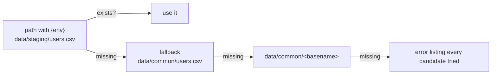
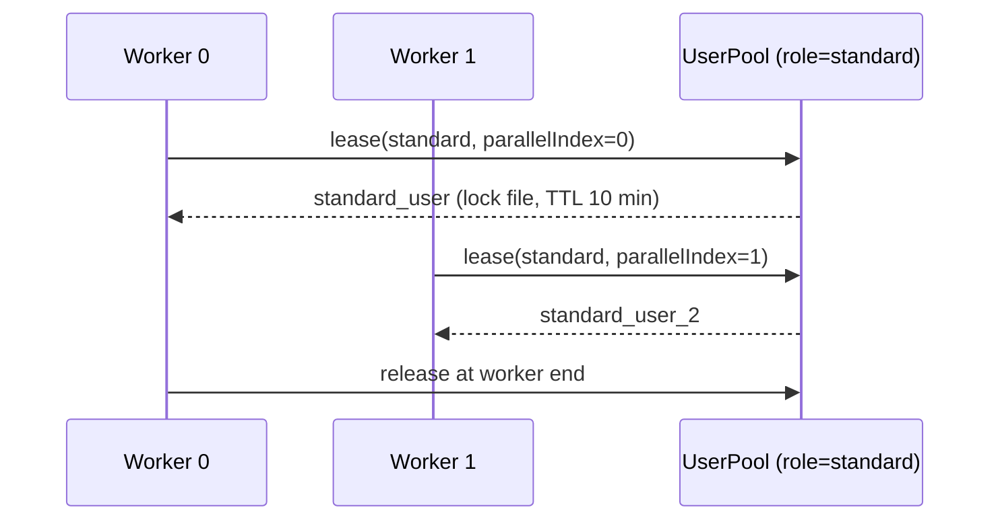

<Learn>
  How datasets are declared and resolved per environment, which loaders exist, how rows become step
  variables, how factories stay deterministic, and how user pools hand out accounts to workers
  without collisions.
</Learn>

## Declare sources

```yaml title="sdods.project.yaml"
data:
  sources:
    users: { type: csv, path: 'data/{env}/users.csv', fallback: data/common/users.csv }
    products: { type: json, path: data/common/products.json }
    posts: { type: yaml, path: 'data/{env}/posts.yaml', fallback: data/common/posts.yaml }
    orders: { type: db, table: td_demo_shop_orders, envColumn: env }
    pet: { type: openapi, spec: ./openapi/petstore.json, schema: Pet }
  factories: ./data/factories.ts
  userPool:
    dataset: users
    roleColumn: role
    leaseStore: file # or db, for runs spread across machines
    leaseTtlMs: 600000
```

## Resolution per environment



Rows are cached per worker; CSV values are cast (`true`, `42`) and `${VAR}` references inside cells are interpolated from the same sources as configuration.

## Use rows in steps

```gherkin
Given I load dataset "users" row 1
When I login with "{{username}}" and "{{password}}"

Given I load dataset "products" where "sku" is "backpack"
Then I should see the text "{{name}}"
```

Columns become `{{variables}}` for the rest of the scenario, alongside `vars` from the environment and values captured from API responses.

## Factories

```ts title="projects/demo-shop/data/factories.ts"
import { defineFactories } from '@sdods/core/data';

export default defineFactories({
  user: (f) => ({ email: f.internet.email(), firstName: f.person.firstName() }),
});
```

```gherkin
Given I generate a "user" from the factory as "newUser"
```

Faker is seeded from the scenario fingerprint, so a retry regenerates the same data.

## User pools



- `users.poolSize` in the environment file caps how many accounts a run may use.
- A lease belongs to `runId:shardOffset+parallelIndex`, so shards never collide.
- The file store uses exclusive lock files under `.sdods/leases/` with a TTL that recovers from crashed workers; the database store uses one conditional insert.
- `@user:standard` on a scenario leases before the browser context is created so the scenario starts logged in; `Given I use a leased user with role "standard"` does it mid-scenario.

## Cleanup

```gherkin
Given I register cleanup DELETE "/posts/{{postId}}"
```

Cleanups run last-in-first-out at the end of the scenario; failures are attached, never fail the scenario.

## Next steps

- [Auth strategies and storage state](/docs/guides/auth-and-storage-state)
- [Data-driven design](/docs/best-practices/data-driven-design)
