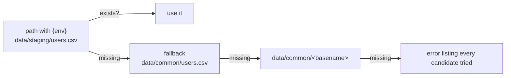
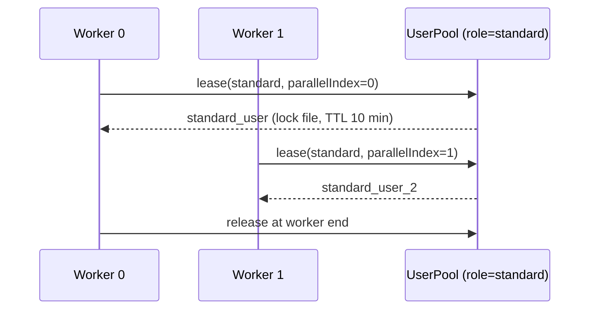

<Learn>
  How datasets are declared and resolved per environment, which loaders exist, how rows become step
  variables, how factories stay deterministic, and how user pools hand out accounts to workers
  without collisions.
</Learn>

## Declare sources

```yaml title="sdods.project.yaml"
data:
  sources:
    users: { type: csv, path: 'data/{env}/users.csv', fallback: data/common/users.csv }
    products: { type: json, path: data/common/products.json }
    posts: { type: yaml, path: 'data/{env}/posts.yaml', fallback: data/common/posts.yaml }
    orders: { type: db, table: td_demo_shop_orders, envColumn: env }
    pet: { type: openapi, spec: ./openapi/petstore.json, schema: Pet }
  factories: ./data/factories.ts
  userPool:
    dataset: users
    roleColumn: role
    leaseStore: file # the only store: lock files under .sdods/leases, one machine
    leaseTtlMs: 600000
    leaseScope: worker # or scenario: release when each scenario ends (see below)
```

## Resolution per environment



Rows are cached per worker; CSV values are cast (`true`, `42`) and `${VAR}` references inside cells are interpolated from the same sources as configuration.

## Use rows in steps

```gherkin
Given I load dataset "users" row 1
When I login with "{{username}}" and "{{password}}"

Given I load dataset "products" where "sku" is "backpack"
Then I should see the text "{{name}}"
```

Columns become `{{variables}}` for the rest of the scenario, alongside `vars` from the environment and values captured from API responses.

## Factories

```ts title="projects/demo-shop/data/factories.ts"
import { defineFactories } from '@sdods/core/data';

export default defineFactories({
  user: (f) => ({ email: f.internet.email(), firstName: f.person.firstName() }),
});
```

```gherkin
Given I generate a "user" from the factory as "newUser"
```

Faker is seeded from the scenario fingerprint, so a retry regenerates the same data.

## User pools



- `users.poolSize` in the environment file caps how many accounts a run may use. It slices the dataset before rows are split by role, so a small value can leave a role short.
- A lease belongs to `runId:shardOffset+parallelIndex`, so two workers of one run never share an owner.
- The store uses exclusive lock files under `.sdods/leases/` with a TTL that recovers from crashed workers. Leases are visible to every worker on one machine and to no other machine: sharded CI jobs on separate runners each need their own accounts. `leaseStore: db` was accepted by earlier releases and never implemented; it is now a configuration error.
- `@user:standard` on a scenario leases before the browser context is created so the scenario starts logged in; `Given I use a leased user with role "standard"` does it mid-scenario.
- Workers waiting for the same role are served in arrival order.

### Lease scope

By default a worker keeps an account from the first scenario that asks for it until the worker exits (`leaseScope: worker`). A worker then keeps one identity across its scenarios, but a role with fewer accounts than workers starves every other worker: each waits `waitMs` (30 seconds by default) and fails the scenario with `USER_POOL_EXHAUSTED`.

`leaseScope: scenario` releases the account when each scenario ends, including accounts leased by the `I use a leased user …` steps. One account then serialises the scenarios that need it, and the other workers keep running everything else. Waiting is the normal path in this mode, so:

- `waitMs` defaults to `leaseTtlMs` instead of 30 seconds.
- The time a scenario spends waiting for an account is added to its timeout, so a scenario at the back of the queue does not time out before it starts.

| Setting                | Holds an account        | Safe for mutating scenarios | One account, many workers           |
| ---------------------- | ----------------------- | --------------------------- | ----------------------------------- |
| `leaseScope: worker`   | until the worker exits  | yes                         | refused by `sdods run` (see below)  |
| `leaseScope: scenario` | until the scenario ends | yes                         | scenarios of that role queue for it |
| `mode: shared`         | never (no lease)        | no                          | every worker uses it at once        |

### Too few accounts for the workers

Before it generates specs, `sdods run` compares each selected `@user:<role>` with the pool. It counts the accounts after `poolSize` and the scenarios of that role that could run at once: the scenarios selected by `--layer`, `--browser`, `--tags`, `--module`, `--feature` and `--since`, less those the tag gate skips (`@env:`, `@skip:`, `@quarantine`). A file that runs serially counts once. When a role has fewer accounts than that number, capped at the worker count, the run stops with exit code 2:

```text
✖ USER_POOL_TOO_SMALL: User pool too small for 4 worker(s) in env staging: role "member" has 1 account(s) but 4 of its scenarios can run at once.
```

The worker count is `--workers`, then `SDODS_WORKERS`, then Playwright's default of half the logical cores. Every browser and layer of one run shares that pool of workers, because `sdods run` starts a single Playwright process. The check is skipped for `mode: shared`, `leaseScope: scenario`, a database or OpenAPI dataset, `--list`, `--ui` and `--debug`. Pass `--allow-pool-contention` to run anyway. `--grep` and `--scenario` are matched against scenario names only, which can only lower the count.

`sdods doctor` prints the accounts per role for each environment next to the worker count (`-w` sets the count it checks against). The row is advisory, because doctor does not know which roles a run selects.

## Cleanup

```gherkin
Given I register cleanup DELETE "/posts/{{postId}}"
```

Cleanups run last-in-first-out at the end of the scenario; failures are attached, never fail the scenario.

## Next steps

- [Auth strategies and storage state](/docs/guides/auth-and-storage-state)
- [Data-driven design](/docs/best-practices/data-driven-design)
