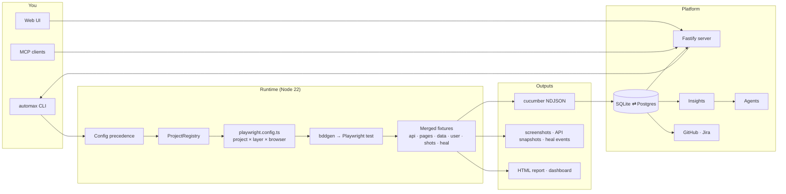

<Learn>
What AutoMax is, which problems it takes off your plate, the CLI-first principle that shapes every feature, and how the packages fit together.
</Learn>

AutoMax is an automation platform with a reusable architecture. It runs on [Playwright](https://playwright.dev). You write scenarios in Gherkin, keep one YAML file per project and one per environment, and drive everything from the `automax` command line. The same commands power the web UI, the MCP server and the scheduler.

## What it adds on top of Playwright

| Concern | Playwright alone | With AutoMax |
|---|---|---|
| UI, API and hybrid scenarios | separate test files, separate fixtures | one merged fixture set; one scenario can seed through the API and assert in the browser |
| Many applications and environments | hand-written `playwright.config.ts` | `projects/<slug>/automax.project.yaml` and `envs/<env>.yaml`, generated Playwright projects per project × layer × browser |
| Configuration | environment variables and code | six layers with fixed precedence, validated, explainable with `automax config show --explain` |
| Test data | ad hoc | CSV, JSON, YAML, database tables and factories per environment; user pools leased per worker |
| Results | HTML report | before/after screenshots per step, API snapshots, run history in SQLite or Postgres, insights |
| Resilience | none | scored self-healing locators with persisted history |
| Tooling around tests | none | MCP server, AI agents that write reviewable proposals, GitHub and Jira, cron schedules, web UI |

## The CLI-first principle

Every capability is an `automax` command that works with no server and no database. The web UI, the MCP server and the scheduler spawn those commands and stream their output. CI needs nothing but Node and the repository.

```bash
bun run automax run -p demo-shop -e staging -l api
bun run automax run -p demo-shop -e staging -l ui -b chromium -t @smoke
```

## How it works



## Packages

| Package | Owns |
|---|---|
| `@automax/contracts` | Zod schemas for the YAML files, identifiers, attachment names, scopes, shared types |
| `@automax/core` | configuration, project registry, fixtures, step library, data providers, screenshots, self-healing, recorder, lint, reporters |
| `@automax/db` | Kysely schema, migrations, ingest, insights |
| `@automax/mcp` | tool registry and MCP transports |
| `@automax/integrations` | GitHub and Jira providers |
| `@automax/agents` | LLM adapters, agent roles, proposals |
| `@automax/server` | REST, SSE, `/mcp`, authentication, scheduler |
| `@automax/web` | the React application |
| `@automax/cli` | the `automax` command |

Playwright's test workers, vitest and the native database drivers run on Node 22. Bun is the package manager, script runner and bundler; pnpm works too. Nothing executes tests under Bun.

## Status

AutoMax ships in phases. Pages that describe commands not yet available carry a **Planned in Phase N** badge; the [roadmap](/docs/roadmap) lists what is done.

## Next steps

- [Install AutoMax](/docs/getting-started/installation)
- [Your first API test](/docs/getting-started/first-api-test)
- [Glossary](/docs/glossary)
