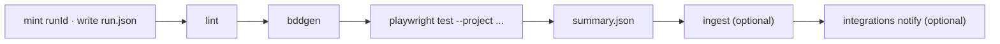

## `run` (alias `test`)

```text
automax run -p <slug> [-e <env>] [-t <expr>] [-l <layer>]... [-b <browser>]... [--process <name>] [--module <name>]...
            [--headed] [-w <n>] [--shard <i/n>] [--retries <n>] [--grep <re>] [--feature <path>] [--scenario <name>]
            [--run-id <id>] [--artifacts-dir <dir>] [--no-lint] [--ingest|--no-ingest] [--allure]
            [--har-update|--har-replay] [--strict] [--update-snapshots] [--repeat-each <n>] [--fail-on-flaky]
            [--max-failures <n>] [--timeout <ms>] [--reporter <list>] [--project-matrix] [--device <name>] [--ui] [--debug] [--list]
```

| Flag | Meaning |
|---|---|
| `-p, --project` | project slug (required unless only one project exists) |
| `-e, --env` | environment (default: `envs.default`) |
| `-t, --tags` | Cucumber tag expression; `smoke,sanity` means `@smoke or @sanity` |
| `-l, --layer` | `ui`, `api`, `hybrid`, `recorded`; repeatable |
| `-b, --browser` | `chromium`, `firefox`, `webkit`, `mobile-chrome`, `mobile-safari`; repeatable |
| `--process` | apply a named process from the project or workspace YAML; other flags override its fields |
| `--module` | restrict to one or more modules |
| `--project-matrix` | every browser declared in the project YAML |
| `--device` | a Playwright device profile |
| `--list` | print the generated Playwright project names and stop |
| `--no-lint` | skip the lint step |
| `--ingest` / `--no-ingest` | force or skip database ingest (default: ingest when a database is configured) |
| `--har-update`, `--har-replay`, `--strict` | HAR mode and strictness |
| `--update-snapshots` | refresh visual baselines |
| `--ui`, `--debug`, `--headed` | Playwright UI mode, inspector, headed browser |

Lifecycle:



Exit codes: `0` pass, `1` failures, `2` configuration error, `3` lint errors, `130` cancelled.

<Planned phase={1} />

## `watch`

```text
automax watch -p <slug> [-t <expr>]
```

Runs `bddgen --watch` and Playwright UI mode together.

<Planned phase={2} />
